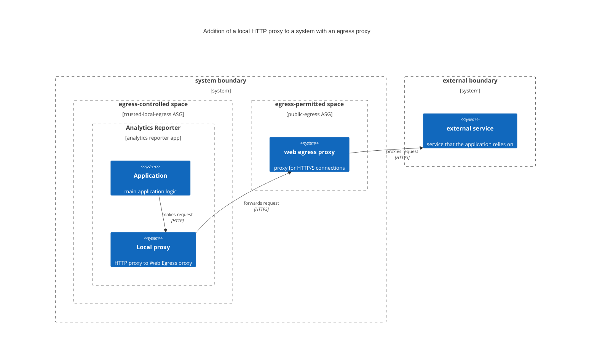

# Local Proxy Server

This includes a "local proxy," a `caddy` server accepting HTTP traffic and forwarding it to a proxy server running as a separate application.

## Why

With the update to GA4, this project pulled in updated code that uses node modules gaxios and grpc/grpc-js. At present, these libraries do not support HTTPS.

We deploy the analytics reporter in restricted egress space and use a proxy in a separate space, as described in the README for https://github.com/gsa-tts/cg-egress-proxy. Since we are committed to having only secured connections between apps in the cloud.gov environment, we cannot send HTTP requests directly from the analytics reporter to the egress proxy.

## What

This proxy server runs in the same container as the Analytics Reporter code (thus keeping non-encrypted requests within the app).

You can compare the diagram below the one in [cg-egress-proxy](https://github.com/gsa-tts/cg-egress-proxy).

## How

The only dynamic configuration of this proxy is the address, including username and password, of the proxy server. The createreport.sh script inserts this into the proxy server's configuration before starting the main loop of running analytics report requests.

The `caddy` binary is pulled at build time from the cg-egress-proxy repo -- we are using the same binary with different configuration. Key points:

* The local proxy accepts all incoming traffic. (Note that there no routes into the container.)
* The accept/deny lists for egress traffic remain exclusively in the configuration of the egress proxy. The local proxy simply forwards HTTP requests to it (via HTTPS).

## What next?

We hope that gaxios, or grpc-js, will soon support HTTPS, at which point we would remove this proxy.