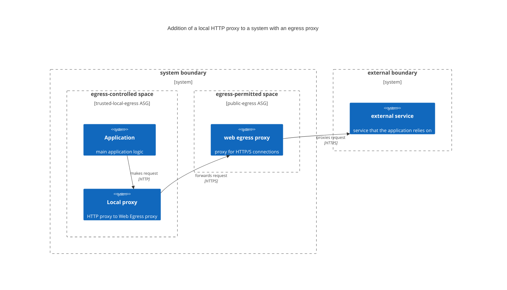

```mermaid
    C4Context
      title Addition of a local HTTP proxy to a system with an egress proxy
      Boundary(system, "system boundary") {
          Boundary(trusted_local_egress, "egress-controlled space", "trusted-local-egress ASG") {
            System(application, "Application", "main application logic")

            System(local_proxy, "Local proxy", "HTTP proxy to Web Egress proxy")
          }

          Boundary(public_egress, "egress-permitted space", "public-egress ASG") {
            System(https_proxy, "web egress proxy", "proxy for HTTP/S connections")
          }
      }

      Boundary(external_boundary, "external boundary") {
        System(external_service, "external service", "service that the application relies on")
      }

      Rel(application, local_proxy, "makes request", "HTTP")
      Rel(local_proxy, https_proxy, "forwards request", "HTTPS")
      Rel(https_proxy, external_service, "proxies request", "HTTPS")


```