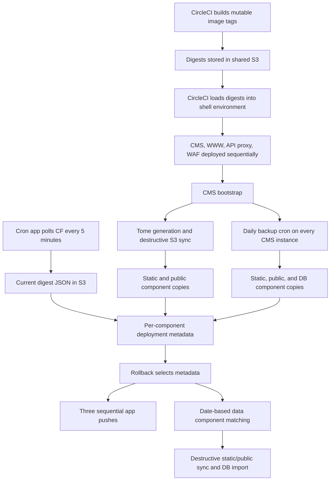

# Backup and Deployment System Audit

Date: 2026-07-20
Reviewed branch: `dev`
Audit type: Static, read-only code and configuration review

## Executive summary

The new backup and deployment system has useful safety work in it, but it is not yet safe to treat as a reliable recovery system. The largest risks are not cosmetic shell issues. Several control paths can execute untrusted shell text in CircleCI, delete backup types that the operator did not request, report success after destructive commands fail, restore unrelated backup components, or leave an environment in a mixed state.

The central architectural problem is that deployment, digest capture, component backup, cleanup, and rollback are separate eventually consistent processes. They do not share an immutable release ID or an atomic backup-set manifest. The code tries to recover that missing relationship later by matching dates and filenames. That is not strong enough for disaster recovery.

This audit found:

| Severity | Count | Meaning |
| --- | ---: | --- |
| High | 22 | Data-loss, unsafe recovery, production availability, and serious security risks |
| Medium | 18 | Material reliability, integrity, test, and operational-control gaps |
| Low | 10 | Incorrect output/docs, dead surfaces, and maintainability issues |

The first work should be to stop unsafe cleanup and downsync behavior, guarantee Drupal state restoration, and ensure that only one scheduler can create a backup at a time. The next architectural step should be a versioned, immutable backup-set manifest that identifies exact static, public, database, and deployment-image versions and is committed only after every required component verifies successfully.

## Remediation status

Last updated: 2026-08-19. Branch: `USAGOV-2827-backup-deployment-audit-results`.

The findings below are preserved as written on 2026-07-20. Work completed since is
recorded here and as a **Status** line on each affected finding; the original
evidence, impact, and recommendation text is left unchanged as the point-in-time
record.

| Status | Meaning |
| --- | --- |
| Resolved | Recommendation implemented and verified |
| Resolved (with deviations) | Implemented except for specific elements, each with a stated reason |
| Partial | Some elements implemented, as direct work or as a side effect of other work; the finding remains open |
| Open | Not started |

A status may carry **(pending live verification)** — the change is implemented and
covered by tests, but part of it runs inside a container or against S3 and has
not yet been exercised there. Each such finding names the cheapest live check at
the end of its status note.

### Findings status

Every finding in this document is listed here, so a change to a medium or low
finding is tracked in the same place as a high one. `Open` means the remediation
work has not addressed the finding — not that it was re-tested on the date of
this note. Statuses below the high table were set by reading the current code
for the findings the work touched; the rest carry their original subject as the
note and have not been revisited.

#### High findings

| ID | Status | Commit | Notes |
| --- | --- | --- | --- |
| H-01 | Resolved | `ad761daf7`, `51272c222` | Exact type set per namespace, fail-closed `all`, checked and verified deletes |
| H-02 | Resolved (with deviations) | `cadf16df0`, `255cb9124` | Preflight-before-mutation, verified recovery point, compensation. S3 staging and DB temp-schema promotion not implemented — see the finding |
| H-03 | Resolved | `11f11b99b`, `1f98a6c07` | Safety backup mandatory and verified; second import path replaced by the maintained restore; remote steps under `set -e`; state and CF target restored by a trap. Follow-up: public files relayed byte for byte between containers with counts checked against both buckets (N-09), `exec_state_command` fixed so it can reach drush (N-10), staged copy discarded on every pre-restore abort, tag-collision guard widened to the public namespace, discard helper targets its space argument (N-13) |
| H-04 | Resolved | `cadf16df0`, `255cb9124`, `<pending>` | State writes are set-and-verified on both sides, both halves aggregate, a sticky flag fails the backup command when restoration fails, the backup command arms a cleanup trap it never had, N-03's trap clobbering is fixed at source, and the CircleCI postamble runs `when: always` against captured prior state. Container-side behavior awaits a deploy |
| H-05 | Resolved | `<pending>` | Only instance 0 schedules the backup, and others clear an inherited entry; concurrent runs are excluded by an atomic S3 `If-None-Match` lock with ownership, expiry and takeover, released after the metadata commit. Confirmed live that `prod` runs 2 CMS instances and `dev`/`stage`/`dr` run 1 |
| H-06 | Resolved | `<pending>` | Sequence discovery matches the full stem including the suffix, so a same-day retry increments instead of overwriting; suffixes carry no leading delimiter; one number is reserved for the whole set; at the cap it refuses rather than resetting to 0. This is the defect observed live as N-12 |
| H-07 | Resolved | `a4db2e6c6`, `<pending>` | One schema (`metadata_version: 1`), one producer, one reader, one validator, all through `jq`. The producer now writes the `containers` key the validator requires; the cron capture is machine-written valid JSON instead of `\n`-concatenated text; rollback validates before deploying, with `--skip-validation` as the override. Readers still accept `deployed_containers`, string-valued digest maps and the legacy escaped form. See the correction in the finding: `a4db2e6c6` alone reads per-component image tags as a mixed release, which is fixed with the H-08 change |
| H-08 | Partial | `<pending>` | Registry/repository/app-tag allowlist and exact `@sha256:[0-9a-f]{64}` form enforced at the single push chokepoint and in the validator; rollback cross-checks every digest against the release record in git, which is reached through GitHub rather than the bucket; metadata records are create-once. Cryptographic signing and S3 Object Lock are **not** implemented — see the finding for why and what they would take |
| H-09 | Resolved | `cadf16df0`, `<pending>` | Date-based pairing is gone. A backup set records a manifest of the exact objects it is made of — including the earlier public backup a smart skip relies on — and restore resolves components from that record or fails closed, with `--public-from=`/`--db-from=` as the explicit override |
| H-10 | Resolved | `<pending>` | Object counting is structural instead of a `\d` regex that matched nothing under GNU grep or BusyBox; an unknown, empty or ungenerated state now refuses instead of falling through to publish; the sync, image sync, backup, cleanup and log upload report their own status rather than `tee`'s; and the success indicator is published only after a post-sync count and sentinel check |
| H-11 | Open | | Mechanism confirmed live 2026-08-20: the change check hashes the S3 key along with the size, so it never matches and the skip never fires |
| H-12 | Open | | |
| H-13 | Open | | Confirmed live: see "Observed during remediation" below |
| H-14 | Open | | |
| H-15 | Open | | |
| H-16 | Open | | |
| H-17 | Partial | `cadf16df0` | Restore-side and downsync-side tag validation added; the rollback and remaining `deploy.sh` remote-shell paths this finding names are untouched |
| H-18 | Open | | |
| H-19 | Open | | |
| H-20 | Open | | |
| H-21 | Open | | |
| H-22 | Open | | Three `printf %q` instances removed from the downsync and restore wrappers; nine remain in `deploy.sh`. One additional instance found — see N-04 |

Medium/Low items touched incidentally: **M-07** partial (exact type helpers exist and
are wired into `clean` and `restore`; backup, delete, and info still use unanchored
matching), **L-02** partial (the `clean all all` and `restore <tag> db` discrepancies
are fixed).

#### Medium findings

| ID | Status | Commit | Notes |
| --- | --- | --- | --- |
| M-01 | Partial | `cadf16df0` | Restore verifies the checksum sidecar when one exists and aborts before any mutation (H-02). The sidecar is still optional, and it sits in the same writable bucket as the backup it attests to, so it is not an authenticity control — that half belongs to H-08 |
| M-02 | Open |  | S3 setup validates only the bucket string |
| M-03 | Open |  | Retention age is still taken from the filename date at midnight. Date-at-midnight is no longer used to *pair* components, which H-09 removed, but the retention path is unchanged |
| M-04 | Open |  | Configured automatic retention is not fully implemented |
| M-05 | Open |  | Static/public stream download can return a valid empty archive after S3 failure |
| M-06 | Open |  | Cron setup can install no usable schedule and still report success |
| M-07 | Partial | `cadf16df0` | Restore resolves `--only` to an exact type set, so an unknown value fails at the boundary instead of restoring nothing and reporting success. `has_backup_type`, used by the backup and cleanup paths, still matches by substring |
| M-08 | Partial | `a4db2e6c6` | Deployment metadata and the cron digest capture are now built and read with jq, so both are escaped by construction (H-07). `audit_log`'s structured line and the remaining `--json` assembly in `manager.sh` and `deploy.sh` are still string concatenation |
| M-09 | Open |  | Predictable temp files and local locks permit races and symlink abuse |
| M-10 | Open |  | SQL denylist validation is incomplete and gives false assurance |
| M-11 | Partial | `cadf16df0`, `a4db2e6c6`, `c405ae6df` | Every test added by this remediation is hermetic — a sandbox with a fake `aws`, drivers run in separate processes — and each is checked against the pre-change commit so it cannot pass vacuously; N-14 fixed an assertion that had been failing permanently. The pre-existing suite still contains non-hermetic checks, including live AWS connectivity |
| M-12 | Open |  | Deployment security scans are not deployment gates |
| M-13 | Open |  | Downloaded CF tooling and container additions are not integrity verified |
| M-14 | Open |  | S3 service-key helper creates persistent credentials and changes the default AWS profile |
| M-15 | Open |  | Digest storage binding is imperative and can drift from the manifest |
| M-16 | Open |  | Project-root discovery can source configuration from the caller's current directory |
| M-17 | Partial | `11f11b99b`, `1f98a6c07` | The downsync cleanup trap restores the CF target, and N-13 fixed a destructive helper that took its destination from the ambient target. The other paths this finding names are unchanged |
| M-18 | Open |  | API proxy deployment has a single-instance availability gap |

#### Low findings

| ID | Status | Commit | Notes |
| --- | --- | --- | --- |
| L-01 | Resolved | `<pending>` | `run_backup_command` interpolated `$STATIC_BACKUP_TAG` and `$PUBLIC_BACKUP_TAG` into its JSON result and neither was ever assigned anywhere, so `backup all --json` reported an empty tag for two of the three components. Both are now assigned, the public one carrying the linked tag when the smart optimization skipped the upload. Found again from the code during H-09 rather than from this document, which is what prompted tracking every finding here |
| L-02 | Open |  | Documentation gives commands with different runtime behavior |
| L-03 | Open |  | The published documentation index still directs recovery to the legacy system |
| L-04 | Open |  | The DR script is not an executable recovery runbook |
| L-05 | Open |  | Several configuration settings and functions are dead or misleading |
| L-06 | Open |  | Legacy and new storage/naming contracts are incompatible |
| L-07 | Open |  | A legacy deployment entry point references absent helpers |
| L-08 | Open |  | PR continuation config references a nonexistent file |
| L-09 | Open |  | Confirmed still open: a failed metadata record fails the backup for the database and static components and is logged as non-critical for public. H-07 routed all three through one function but deliberately left each caller's policy as it was |
| L-10 | Open |  | Duplication and file size obscure control flow |

### Defects found during remediation

These were not in the original audit. They were found by executing the code rather
than reading it.

| ID | Status | Description |
| --- | --- | --- |
| N-01 | Fixed (`51272c222`) | Database retention cutoff used `date -v-48H` / `date -d "48 hours ago"`. BusyBox `ash` — the CMS container's `/bin/sh` — supports neither, so the cutoff was empty and `cleanup_old_db_backups` aborted before deleting anything. Database retention had never run in a container. The old code discarded the return value and printed "Cleanup complete", which is why it was invisible. Now uses epoch arithmetic, and fails closed if the floor is unconfigured rather than defaulting to 0 |
| N-02 | Fixed (`cadf16df0`) | `print_status` passed its message as a `printf` format string, so any `%` in a message corrupted operator output (`50% floor` printed as `50 0.000000loor`). Now passed as data |
| N-03 | Fixed (H-04 work) | `create_db_backup` installed its own `EXIT` trap and then cleared it with `trap - EXIT ERR`, discarding any caller's handler. Originally worked around in `cadf16df0` by re-arming the restore's trap after each call; now fixed at the source. The function installs no trap and clears none, the temp paths are globals so the caller's handler removes them, and the three re-arms in `restore_create_recovery_point` are gone. Note the first dynamic test written for this passed against the unfixed code — `create_db_backup` returns at a missing helper long before reaching the trap lines when called outside `manager.sh`, so the assertion was vacuous. It is now a structural check, which does fail against the old code |
| N-04 | Open | `get_next_backup_suffix` uses `lockfd=200` with `exec 200>`. `dash` supports only single-digit file descriptors, and a failed `exec` terminates a non-interactive shell — so `manager.sh backup` dies silently under `dash`. BusyBox and Bash are unaffected, so production is not impacted, but any `dash` host (Ubuntu CI, developer machines) cannot run backup. Folds into H-22 |
| N-05 | Documented | `aws --query 'length(Contents)'` is applied **per page**, not to the aggregated result: a 5,091-object prefix reports `1000`. Any future guard built on it silently passes. Counting must enumerate keys. Applies to H-10's proposed object-count guard |
| N-06 | Open | The live destinations `web/` and `cms/public/` are hardcoded string literals in the restore path, so the destructive phases cannot be redirected to a scratch prefix for testing. Only the recovery-point and preflight phases are testable against real S3 without touching live data |
| N-08 | Open | `validate_backup_tag` does not enforce its own length limit. The check calls `handle_error "..." "validation" "return"`, but that returns from `handle_error`, not from the validator, so execution falls through to `return 0`. Verified: a 250-character tag passes with rc=0 against `TAG_MAX_LENGTH=200`. The character-set check is unaffected — it does `return 2` directly, so the injection-relevant guard works, which is why this went unnoticed. The same discarded-`handle_error` pattern appears in `validate_output_path` and `validate_sql_content`, where a later check happens to reject the input anyway. Low severity on its own; worth fixing as a pattern rather than one instance |
| N-07 | Fixed (H-03 work) | `downsync` uploaded public files with `--acl public-read`, making every synced object world-readable. Verified against the DR bucket: live `cms/public` objects and objects in backups predating this work are all private, and no bucket policy grants public read — so this one code path was an outlier that widened access on files that are otherwise served through Drupal with credentials. Worth confirming whether any environment currently holds world-readable objects in `cms/public` as a result of past downsyncs. **Confirmed on 2026-08-06: it does.** `dev` holds `cms/public/._.` (163 bytes, created 2026-08-05 01:30:44), and `aws s3api get-object-acl` shows it granting `READ` to `http://acs.amazonaws.com/groups/global/AllUsers`. It is an AppleDouble side-car — see N-09 — so this single object is evidence of both defects landing in live data together: a downsync run from a Mac injected a junk file into live public files and made it world-readable. `stage` and `dr` hold none. `prod` was not checked (no access) and should be |
| N-09 | Fixed (H-03 work) | `downsync` relayed public files by unpacking the source archive on the operator's machine and repacking it, which corrupts the data on macOS in **both** directions. macOS `tar` (bsdtar) carries extended attributes as AppleDouble side-car members named `._<entry>`, and every file and directory on a current macOS holds at least `com.apple.provenance` — so repacking emitted one side-car per entry, and BusyBox `tar` in the container unpacked them as ordinary files. Observed live: a 4,895-file public tree staged as **10,105** objects in `dr` (`._.`, `._2022-03`, `._2022-04`, …). Unpacking has the mirror defect: a file whose own name begins with `._` is read as metadata for a partner that is not in the archive and is **silently dropped, with exit status 0**. Neither `--no-mac-metadata` nor `COPYFILE_DISABLE=1` suppresses both halves (`--no-mac-metadata` fixes the repack and is additionally rejected in list mode). Fixed by removing the local `tar` from the transport entirely: the archive is now relayed byte for byte from the source container to the target container, and both file counts are taken from the two buckets by the container's own `aws` CLI. **The pre-H-03 downsync had the same `tar` pipeline but synced straight into live `cms/public/` with `--acl public-read`, so a downsync run from a Mac wrote thousands of world-readable junk files into live data and exited 0.** The H-03 staged-count guard is what caught it, one step before any live mutation |
| N-10 | Fixed (H-03 work) | `exec_state_command` built its remote command as `cd /var/www && . scripts/common.sh && state_command …`. Sourcing `common.sh` does not put `drush` on `PATH` — `init_backup_system` does — and the command did not source `/etc/profile` either, so **every `drush` call inside `state_command` exited 127**. Verified in the `dr` container: `drush` is not found without `/etc/profile`. The consequences were silent and inverted: `is_tome_running` failed, which reads as "Tome has stopped"; `drush sget` returned empty, recorded as `tome_disabled="0"` against a real value of `1`; and `drush sset` failed, so nothing was ever disabled. `deploy.sh state disable` and `state enable` have therefore never worked. The pre-H-03 downsync ran the equivalent command as `… >/dev/null 2>&1` with no status check, so **restores proceeded without maintenance mode and without Tome disabled, reporting success**. H-03's status check turned this into a visible abort, which is how it was found. Fixed by sourcing `/etc/profile` and calling `init_backup_system` in the remote command |
| N-12 | Open | The pre-downsync safety backup reuses suffix `-0` for every run into the same space on the same day, so each run **overwrites the previous safety backup**. Observed live: three downsyncs into `dr` between 20:37 and 21:01 on 2026-08-05 all produced `DOWNSYNC-dr-16277-2026-08-05--pre-downsync-0`, and only the last one's objects survive. The current run is still protected, so this is not an H-03 gap, but the failure mode it creates is bad: if a downsync leaves a space damaged and the operator reruns it, the second run's safety backup captures the damaged state and destroys the good recovery point. `get_next_backup_suffix` is the relevant function — the same one implicated in N-04 |
| N-13 | Fixed (H-03 work) | `_downsync_discard_staged_backup`, added by the H-03 work, took the space name only for its messages: the recursive `aws s3 rm` went to whichever space `cf` happened to be targeting. Inside the downsync this was correct, because the target is set two steps earlier — but the helper is exactly the thing an operator reaches for after an aborted run, at which point the trap has already restored the CF target to the **source** space. Found by it happening: invoked out of band as `… "$tag" dr` while the ambient target was `dev`, it deleted `dev`'s own copy of that backup — 4,895 public objects and both database objects — and reported that it had cleaned `dr`. The follow-up count query, run against the same ambient target, returned zero and read as confirmation. Recovered in full from the copy staged in `dr`: the database object is byte-identical (34,433,605 bytes, stored checksum recomputed against the restored object in `dev`'s bucket) and all 4,895 public objects are back. Fixed by having the helper target the named space itself and abort if it cannot. A destructive helper whose destination comes from ambient state is the defect; the operator error only exposed it |
| N-15 | Fixed (H-04 work) | Every cleanup handler added by this remediation — `restore_cleanup` (H-02), `downsync_cleanup` (H-03), and `backup_cleanup` (H-04) — was installed as `trap handler EXIT INT TERM HUP`. A POSIX signal trap returns control to the interrupted command, so on `INT`/`TERM`/`HUP` the handler cleaned up and the operation then **continued with its state already restored**. Found by sending `TERM` to a running backup in `dr`: maintenance mode was cleared and the backup carried on. For a database backup the data outcome was still safe, but a restore or downsync continuing past its own cleanup could mutate live data with maintenance mode off and the CF target already reset. Fixed with `arm_cleanup_traps`, which terminates on signals with the conventional 128+signal status and keeps `EXIT` to cleanup only; handlers carry a run-once guard because the explicit exit re-triggers `EXIT`. Only reachable by an operator or scheduler signalling a run, which is why three rounds of hermetic tests and two live rehearsals had not surfaced it |
| N-14 | Fixed (H-04 work) | `test_state_management` in `scripts/snapshot/test.sh` asserted `grep -q '"--ssm"'` — the flag with surrounding double quotes — which `manager.sh` has never contained; it appears as an unquoted `case` pattern. The assertion therefore failed permanently, so the suite reported `SOME TESTS FAILED (1/36)` on every run and any genuine regression was indistinguishable from the standing failure. The flag itself works. Fixed to match the real form; the suite is now green, which is what makes the new H-04 assertions meaningful |
| N-16 | Fixed (H-07 work) | `show_current_digests` read `.timestamp` and `.environment` by piping the **raw** capture text into `jq`, while separately expanding the escapes with `printf '%b'` for the container list only. For the legacy escaped capture — the one shape the expansion exists to handle, and the shape actually in the buckets — the two `jq` calls therefore parsed nothing and returned empty, so "Last Updated" never appeared and a stale capture looked no different from a fresh one. Fixed by normalizing once and reading every field from the parsed document; the display now also prints the capture's age and refuses a capture it cannot parse |
| N-17 | Fixed (H-07 work) | The producer and its readers were coupled to the **malformed** form of the capture, so fixing either half alone would have silently emptied the metadata. `capture_deployment_metadata` extracted the container list with `sed -n 's/.*"containers":[[:space:]]*{\([^}]*\)}.*/\1/p'`, which requires the whole object on one line — exactly what `\n`-concatenation produces when the shell's `echo` does not expand the escapes. Reproduced locally: against that one-line form the expression returns `cms waf www`, and against properly formatted multi-line JSON it returns **nothing**. An empty list is not caught downstream either, because the `cms www waf` fallback is guarded by `command -v cf`, and `cf` is not on `PATH` inside the CMS container — so the backup would have recorded `deployed_containers: {}` and reported success. This is why the new cron capture is emitted **compact** (`jq -nc`): it is valid JSON for the new readers and still matches the single-line `sed` expressions in any reader deployed before this change, which matters because `cron` and `cms` are separate apps that deploy independently |
| N-18 | Open | The CircleCI deploy path does not pass through `deploy.sh`, so H-08's push gate does not cover it, and it is **fail-open**. `.circleci/config.yml` loads each digest with `if aws s3 cp s3://${S3_BUCKET}/${DOCKERUSER}/${DOCKERREPO}/cms-<pipeline> ./cms-image-digest; then export CMS_DIGEST="@"$(cat …); fi` — on any failure the variable is simply left empty, no error is raised, and `bin/cloudgov/deploy-cms` then takes its `[ -z "$CDIGEST" ]` branch and pushes `${DOCKERUSER}/${DOCKERREPO}:${app}-${CTAG}`, an unpinned **mutable tag**. A failed digest lookup therefore silently downgrades a pinned deployment to whatever that tag points at, which is the weakness H-08 is about, reached without any tampering. `deploy-cron`, `deploy-reporter` and `deploy-waf` push from the same CI-written bucket. Not fixed here because making the lookup fail closed changes when the pipeline refuses to deploy, which is the team's call rather than an audit fix; the change itself is small — treat an empty digest as an error in `load-image-digest` |
| N-11 | Open | `printf '%q'` is a Bash extension, not POSIX, and appears at five sites in `#!/bin/sh` scripts (`deploy.sh` ×2, `local-manager.sh` ×3). Under `dash` it emits `printf: %q: invalid directive` and the arguments are lost: `exec_backup_command` then runs `manager.sh backup` with no types, ticket or suffix, producing a wrongly-tagged backup. Verified by running the downsync suite under `dash` — 26 assertions fail, identically before and after the H-03 work, so this is pre-existing and not a regression. macOS and the containers are unaffected because their `/bin/sh` is Bash and BusyBox respectively. Folds into H-22, which already tracks the declared-shell mismatch. `scripts/tests/downsync-tests.sh` detects this case and prints a notice, so the resulting mass failure under `dash` is not mistaken for a regression in the downsync logic. Note the `USAGOV-2835-deply.sh-bugs` branch replaces `printf %q` with a POSIX `shell_quote` helper, which would close this; that branch is not merged into this one |

### Verification performed

Hermetic behavioral tests were added to `scripts/snapshot/test.sh`
(`test_cleanup_type_isolation`, `test_restore_preflight_and_compensation`). They use
a directory-backed fake `aws` and fake `drush`, so they contact no real store and can
run anywhere. Both pass under `bash`, `dash` (where the interpreter permits) and
BusyBox `ash`.

A full end-to-end restore was rehearsed in the `dr` space on 2026-08-04 using
`AUTO-dr-16273-2026-08-03-0`:

- Completed in 5 m 37 s, exit 0. Maintenance window ~5 minutes.
- The pre-restore recovery point (5,091 static objects, 4,803 public objects, and a
  291 MB database dump) took 1 m 55 s of that — the measured cost of H-02's safety.
- Restored database matched the dump structurally (636 tables in both), with 2,228
  nodes / 22,672 revisions / 90 users intact.
- Drupal state was returned to its **captured prior values** (`maintenance_mode=0`,
  `usagov.tome_run_disabled=1`), not to hardcoded defaults.
- `beta-dr.usa.gov` and `cms-dr.usa.gov` both returned HTTP 200 afterwards.

This is the first evidence in this audit that a named recovery point is actually
restorable end to end. It covers one path only: static, public, and database from a
single complete same-tag backup, in one environment, with no injected failure.

A full cross-space downsync was then run `dev` → `dr` on 2026-08-06 using
`AUTO-dev-16254-2026-08-05-0`, exit 0:

- The source backup contained an object literally named `cms/public/._.` — AppleDouble
  residue from an earlier Mac-run downsync into `dev` (see N-07, N-09). It made the run
  a fidelity test on real data: source **4,896** objects, staged **4,896**, live
  **4,896**, with `._.` intact. The naive fix for N-09 (`--no-mac-metadata`) would have
  reported 4,895 and dropped that file silently.
- `dr` ended up byte-for-byte equivalent to `dev` in content: 2,230 nodes, 2,135
  published, `MAX(nid)` 2534 in both, 636 tables, Drupal bootstrap successful.
- The relayed `._.` object is **private** in `dr` while `dev`'s identical object grants
  `AllUsers: READ` — N-07's fix and the pre-existing exposure, side by side on one file.
- Two independent recovery points were produced and verified: the pre-downsync safety
  backup (`DOWNSYNC-dr-16290-2026-08-06--pre-downsync-0`) and the restore's own
  (`PRERESTORE-dr-16290-2026-08-06-0`).
- The safety backup waited **~14 minutes** for an active `tome-run.sh` to finish before
  it could dump. This is correct behavior, but it means downsync availability depends
  on the Tome cycle and can hit the 25-minute cap and abort before doing anything.
- Drupal state was returned to its captured prior value (Tome enabled). Note the Tome
  key comes back as empty rather than the literal `0` that was captured — both are
  falsy so the behavior matches, but the round trip is not value-exact. Same area as
  the `restore_drupal_state` gap noted under H-13.
- `beta-dr.usa.gov` and `cms-dr.usa.gov` returned HTTP 403 `Forbidden by USAGov`
  afterwards. That response is generated by the **waf** app's nginx
  (`ip-restrict-*.conf`, `deny-by-domain.conf`) — a separate application whose config
  the downsync cannot reach, since it writes only S3 objects and the Drupal database.
  `web/index.html` was present and regenerated during the run, and Drupal bootstraps,
  so this is an access restriction on the requester, not a site failure. `beta-stage`
  returned 200 from the same client at the same time.

A hermetic suite for the downsync backs this up, now committed as
`scripts/tests/downsync-tests.sh` with its fakes in `scripts/tests/downsync-fakes.sh`:
74 assertions over 16 scenarios, passing under `/bin/sh`, using fake `cf`/`aws`/`drush`
and two fake spaces. An earlier version of this suite lived only in a scratch directory
and was lost when that was cleaned; rebuilding it in the repository is what stops that
happening again. Run it with `sh scripts/tests/downsync-tests.sh`.
It includes a fake BusyBox `tar` that treats `._` members literally, so the N-09
regression is caught without a container, and it asserts that `deploy.sh` runs **no**
local `tar` during a downsync. Covered: the happy path, a missing or failed safety
backup, a mid-chain remote failure, a truncated dump, an empty public backup, a tag
collision in either namespace, a failed import, a failed post-import step, the
`--acl public-read` regression, a failed target switch, a lossy relay, and a relay that
gains files. It does **not** cover the `dash` interpreter — see N-11, which fails there
identically before and after this work.

### Live verification, 2026-08-20 (`dr`, build 16346)

H-01 through H-10 were exercised against the deployed build rather than only in
tests. What that found, in order of consequence:

**Three defects that only a live run could surface.** All three were in code this
remediation added, and all three passed their hermetic tests.

1. `run_backup_command` took the H-05 backup lock **before** `setup_s3_vars`, and
   `BUCKET_NAME` is set by nothing else — not the container environment, not
   `init_backup_system`. Every backup in a context that does not pre-export it
   refused with "Cannot acquire the backup lock: bucket is not configured". That
   includes the 23:00 crontab entry and any operator run over `cf ssh`; `crond`'s
   environment carries `VCAP_SERVICES` but not `BUCKET_NAME`. The Tome-triggered
   backup escaped it only because `tome-run.sh` exports the variable itself,
   which is why static and public backups kept appearing while the database
   backup — produced only by the 23:00 path — did not. The H-05 lock test sets
   `BUCKET_NAME` in its own driver, so it never exercised the ordering.
2. `CONTAINER_TAG` was empty when the set stem was built, because each component
   function assigns it far later. The stem came out as `PREFIX-dr--DATE`, matched
   no object, and **every set was numbered 0** — so a same-day retry of a named
   backup reused `-0` and overwrote the previous set, which is exactly what H-06
   exists to prevent. `test_backup_set_numbering` passes a stem in, so it could
   not see this.
3. The same empty tag keyed every H-09 manifest as `PREFIX-dr--DATE-N.json`, a
   name no restore looks up, leaving the manifest inert. The manifest test calls
   the writer directly.

Both orderings are now fixed and confirmed live: a named database backup twice in
one day produced `retry-0` then `retry-1` with both objects intact, and the
manifest is keyed by the real tag with exact S3 keys.

**H-10's stated mechanism was wrong** and its impact statement was right for a
different reason. See the correction in that finding.

**H-11's mechanism was identified** while testing H-09's link path. See that
finding.

**What each finding was checked with.**

- **H-01** — `delete <tag> static` removed 520 static objects and left public (26)
  and database (2) untouched.
- **H-02** — a real database restore ran end to end: checksum, archive integrity,
  disk space and SQL structure all verified before any mutation, recovery point
  created, state returned to its captured values, `beta-dr.usa.gov` HTTP 200
  afterwards. This re-covered the path because H-09 changed component resolution
  inside it.
- **H-04** — state captured as `maintenance_mode="0" tome_disabled="0"`, Tome
  disabled and **verified** as `1`, restored and verified as `0`, maintenance mode
  enabled to `1` and restored to `0`, on every component of the run.
- **H-05** — `backup_lock_acquired` … `backup_lock_released` with
  `instance_index="0"` and no lock object left behind. The instance guard is
  present; `dr` runs one instance.
- **H-06** — `retry-0` then `retry-1`, both objects present.
- **H-07** — metadata written as `metadata_version: 1`, `complete: true`,
  `age_seconds: 232`, `stale: false`, `environment_match: true`, and
  `capture.parse: "legacy-escaped"`. That last field is the compatibility path
  working against real legacy data: the `cron` app had not been redeployed, so the
  capture object was still the `\n`-concatenated form, and the new reader consumed
  it. The `cron` app needs its own deploy for the producer half of H-07.
- **H-08** — all three digests of a real 16185 backup were **confirmed against the
  `usagov-cci-build-16185-dr` git record**, with the build number taken from the
  backup tag because legacy metadata carries no release id. A substituted digest
  was refused with both values named; an unknown build degraded to a warning as
  designed. The allowlist accepted the real reference and refused a foreign
  repository, a foreign registry, a cross-app tag and an unpinned reference.
  Note that live digests are **untagged** (`gsatts/usagov-2021@sha256:…`), so
  `release.mixed` cannot be detected from them — the release id came from the
  container's own motd.
- **H-09** — manifest written with exact keys; resolution returned the recorded
  component and **refused public for a set that never had one**, listing real
  candidates, inside the actual `restore` command, with same-day public backups
  present that the previous code would have silently adopted.
- **H-10** — see that finding.

**Known gaps after this session.** The `cron` app is still running pre-audit code
(last deployed 2026-08-18), so H-07's capture producer is not live. `delete` and
`clean` do not remove `backup-manifests/` or `deployment-metadata/` objects, so
those accumulate; resolution fails closed when a recorded component's objects are
gone, so this is orphan accumulation rather than a correctness gap. `delete <tag>
all` reports "No backups found" instead of resolving `all` to the three types,
which is an M-07-shaped surprise rather than a data risk.

### Observed during remediation

**H-13 confirmed live.** The H-02 recovery point reuses `create_db_backup`, which
writes `deployment-metadata/<tag>.json`. After the DR rehearsal,
`PRERESTORE-dr-16275-2026-08-04-0.json` became the newest metadata object, so a
zero-argument `deploy.sh rollback` would now select the recovery point rather than a
deployment. During earlier scratch-prefix testing the same mechanism produced a
metadata object whose components did **not** exist, because the metadata path is not
governed by the component path variables. H-13's lifecycle work needs to decide
whether recovery points belong in the rollback candidate set.

## Scope and method

The audit covered the current and legacy paths that create, deploy, discover, restore, or delete backups, including:

- `scripts/common.sh`
- `scripts/snapshot/*`
- `scripts/devops/*`
- `scripts/tome-*.sh`
- `scripts/cron/*`
- `.circleci/config.yml` and `.circleci/config.pr-check.yml`
- `manifest*.yml`
- CMS and cron container bootstrap/scheduling files
- Deployment helpers under `bin/cloudgov` and `bin/deploy`
- Legacy recovery helpers under `bin/snapshot-backups`
- Backup, deployment, digest-sync, and DR documentation

The review traced callers across CircleCI, Cloud Foundry SSH, CMS bootstrap, cron, Tome, S3, and Drush. It also ran side-effect-free syntax and interpreter checks. All selected scripts pass `sh -n`, but that is misleading: direct checks under `dash` prove that `printf %q` fails and `${value:0:1}` raises `Bad substitution` even though `dash -n` accepts the files.

## High findings

### H-01: Type-specific cleanup deletes the other backup type and hides failures

**Evidence:** `run_clean_command` calls a single static/public cleanup helper whenever either type is selected at [scripts/snapshot/manager.sh](scripts/snapshot/manager.sh#L842-L850). That helper always iterates and deletes both static and public namespaces at [scripts/snapshot/manager.sh](scripts/snapshot/manager.sh#L2028-L2090). `clean all all` then calls database cleanup, but database cleanup rejects `all`; the dispatcher ignores that return and prints completion at [scripts/snapshot/manager.sh](scripts/snapshot/manager.sh#L850-L859). Delete failures inside pipelines are also not accumulated at [scripts/snapshot/manager.sh](scripts/snapshot/manager.sh#L1845-L1910).

**Impact:** `clean static ... -y` can irreversibly delete matching public backups, despite the prompt naming static backups. `clean all all` can leave every database backup intact while reporting complete. Failed S3 deletes can also produce a successful exit.

**Recommendation:** Pass an exact normalized type set to cleanup, guard each namespace independently, run deletion loops outside pipeline subshells, collect every list/delete result, and verify the resulting inventory before success.

**Status (2026-08-04): Resolved** in `ad761daf7`, `51272c222`. `clean_old_backups` now takes a normalized type set and guards each namespace independently, so `clean static` cannot touch public. Loops are fed by redirection instead of a pipeline, every list and delete result is checked, each deletion is verified absent, and per-type counts drive the exit code and `--json` output. `clean all all` fails closed before deleting anything rather than wiping static/public and silently skipping the database. Listings use `list-objects-v2`, which distinguishes an empty namespace from an unreadable one. Also hardened: unknown types, unknown arguments, missing option values, and non-numeric day counts are rejected before any deletion, and the `all` filter requires explicit types. Verified by `test_cleanup_type_isolation` and by failure-injection runs against real S3 in `dr`. See also N-01, which this work exposed.

**Relevant controls:** NIST 800-53 CP-9, SI-10, AU-3.

**Confidence:** High.

### H-02: Restore is destructive and non-atomic across three independent stores

**Evidence:** Restore replaces static and public S3 trees with `sync --delete`, then drops and imports the database at [scripts/snapshot/manager.sh](scripts/snapshot/manager.sh#L2478-L2607). All preflight checks are not completed before the first mutation, and there is no compensation if a later phase fails.

**Impact:** A database download, decompression, validation, drop, or import failure can leave current static content, public files, and database content from different generations. A failed database import can leave an empty or partially imported database. The script can only print recovery instructions after damage is already done.

**Recommendation:** Verify every requested component, checksum, schema, and free-space requirement before mutation. Create a mandatory pre-restore recovery point. Stage S3 data under temporary prefixes and switch atomically where possible. Restore the database through a temporary schema or managed RDS snapshot workflow, then promote only after validation. Add compensation for every completed phase.

**Status (2026-08-04): Resolved, with two deviations** — `cadf16df0`, `255cb9124`.

Implemented:

- Restore is now five phases, and nothing is mutated until every check for every requested component has passed. The database dump is downloaded, checksum-verified, integrity-tested (`gunzip -t`), space-checked, decompressed, and structurally validated (`validate_sql_dump`, which restore never called before) **before** the S3 trees are touched. Previously all of that ran only after both trees had been replaced.
- A pre-restore recovery point is created for every component being replaced and verified present in S3 before mutation begins. Overridable with `--no-recovery-point`, which is audit-logged.
- Any phase failure rolls back the phases already applied, so a partial restore converges to one generation instead of a mixed one.
- A `sync --delete` from a backup holding less than `RESTORE_MIN_SOURCE_PERCENT` (default 50) of the live object count is refused unless `--force-destructive-sync` is given. An empty backup would previously have deleted the entire live tree.
- Cleanup, temp files, and Drupal state are released on `EXIT`, `INT`, `TERM`, and `HUP`.

Not implemented, deliberately:

1. **S3 temp-prefix staging with an atomic switch.** S3 has no atomic prefix rename. Staging then copying still leaves a non-atomic window while doubling the data moved. Recoverability is delivered by the verified recovery point plus rollback instead.
2. **Database restore through a temporary schema, promoted after validation.** The privilege exists (`CREATE DATABASE` was confirmed available on the DR instance), but retargeting a schema requires parsing `drush sql:connect`, whose output contains `--password=`, which would introduce an H-19-class credential-in-argv exposure into the most sensitive script. Promotion also requires renaming ~636 tables across schemas, which is not atomic either. Full offline validation plus automatic rollback covers the realistic failure modes — truncation and corruption — at far lower risk. This should be revisited if a managed RDS snapshot workflow becomes available, which would avoid both problems.

Verified by `test_restore_preflight_and_compensation` and by a real end-to-end restore rehearsal in `dr` — see "Verification performed".

**Relevant controls:** NIST 800-53 CP-10, CP-9, SI-7.

**Confidence:** High.

### H-03: Downsync can report a successful database restore after decompression or import failed

**Evidence:** Downsync proceeds when its safety backup fails at [scripts/devops/deploy.sh](scripts/devops/deploy.sh#L1934-L1952). Its remote restore command uses `gunzip; drush sql-cli; rm` separated by semicolons, then checks the SSH command's final status at [scripts/devops/deploy.sh](scripts/devops/deploy.sh#L2034-L2060). If `gunzip` or `drush` fails and `rm` succeeds, the command returns success. Public upload/extraction pipelines and later state restoration are also incompletely checked at [scripts/devops/deploy.sh](scripts/devops/deploy.sh#L2066-L2150).

**Impact:** A target can receive a partial database while the command reports success and continues. Failure paths after state disable can leave Tome disabled or maintenance mode enabled. Proceeding after the safety backup fails removes the only automatic recovery point.

**Recommendation:** Abort if the safety backup cannot be created and verified. Reuse one checked restore implementation instead of a second import path. Use a fixed remote script with `set -e`, checked `&&` transitions, checksum validation, and an exit trap that restores Drupal state and the original CF target.

**Status (2026-08-04): Resolved.** Every element of the recommendation is implemented.

- **Safety backup is now mandatory and verified.** A non-zero backup status stops the downsync, and because a backup type whose `ENABLE_*` setting is false returns success without writing anything, the backup object itself is confirmed to exist before anything is modified.
- **The second import path is gone.** Downsync no longer runs its own `gunzip; drush sql-cli; rm`. It stages the source backup into the target space's own backup namespace — with a checksum computed locally, so the transfer is verified end to end — and then calls `exec_restore_command`, the single maintained restore implementation. Downsync therefore inherits everything added for H-02: preflight before mutation, checksum and archive validation, a verified recovery point, and automatic compensation.
- **Remote commands are fixed text under `set -e`.** The `;`-chained form returned the status of the final `rm`, so a failed decompression or import reported success. Each remote script now aborts on the first failure. The public upload and staged-object count are checked, and the staged count must match what was downloaded.
- **An exit trap restores Drupal state and the CF target** on `EXIT`, `INT`, `TERM`, and `HUP`, including the failure paths that previously exited while leaving the target in maintenance mode with Tome disabled.
- **Post-import steps are reported individually.** `drush cr`, `updatedb`, `cim`, `node_access_rebuild`, and the MFA config step each report ok/FAILED, and the command exits non-zero if any failed. Previously they ran as one chained command whose status came from the last one.

Also fixed here: the downsync tag is validated at the boundary (closing the downsync half of H-17), and `printf %q` is removed from this path and from `exec_restore_command` (two H-22 instances).

Behavior changes worth knowing:

1. Public files in the target are now made to match the source exactly (`--delete`), where previously files existing only in the target survived.
2. Public files are no longer uploaded with `--acl public-read`. This was verified against the DR bucket: live `cms/public` objects and objects in backups predating this work are all private, and no bucket policy grants public read, so `--acl public-read` was an outlier in this one code path that made every synced file world-readable. See N-07.
3. The database is now dropped before import rather than imported over the existing schema, so tables present only in the target no longer survive a downsync.
4. Post-import step failures now produce a non-zero exit instead of a warning.

Verified by `scripts/tests/downsync-tests.sh` — 44 assertions against fake `cf`, `aws`, and `drush` with two fake spaces, covering the happy path, unverified safety backup, mid-chain remote failure, truncated download, empty public backup, tag collision, failed import, post-import failure, and target-switch failure.

Additionally verified against the real `dr` deployment on 2026-08-04 (24 assertions, no mutation):

- **The central defect and its fix were reproduced against real infrastructure.** Through real `cf ssh` into the BusyBox container, `"gunzip -f bad.gz; rm -f x.sql"` returns **0** — the silent data loss this finding describes — while the same commands under `set -e` return **1**. `cf ssh` propagates the remote status correctly, and BusyBox honors `set -e` in a `-c` string, so the fix rests on verified behavior rather than assumption.
- Argument and space validation, tag validation at the boundary, and a declined confirmation all stop before any mutation, with the operator's CF target restored by the trap.
- `exec_restore_command`'s guard rails reject an invalid tag, an invalid `--only`, and an unsupported forwarded flag, each without invoking `cf`.
- `_downsync_verify_safety_backup` runs against real S3 and returns a definite result.

**Not** verified end to end: a real downsync overwrites an entire environment's database and public files, which would require destroying one. That remains the only untested path in this finding.

**Relevant controls:** NIST 800-53 CP-10, CM-3, SI-7.

**Confidence:** High.

### H-04: Drupal state restoration is not guaranteed and can return success after failure

**Evidence:** State is process-local in [scripts/common.sh](scripts/common.sh#L1581-L1602). In the `both` restore path, maintenance restoration failure is logged but execution continues and can return success after Tome restoration at [scripts/common.sh](scripts/common.sh#L1745-L1806). Backup and restore callers discard restoration status at [scripts/snapshot/manager.sh](scripts/snapshot/manager.sh#L1158-L1162) and [scripts/snapshot/manager.sh](scripts/snapshot/manager.sh#L2628-L2635). CircleCI disables and enables state in separate processes, and its postamble is a normal subsequent step rather than unconditional cleanup at [.circleci/config.yml](.circleci/config.yml#L146-L194).

**Impact:** A failed or interrupted backup can leave production in maintenance mode or leave Tome disabled while CircleCI reports only the original backup failure. The separate postamble cannot recover the prior state because the captured values existed only in the first process.

**Recommendation:** Manage prepare, operation, and restore in one process with an `EXIT`, `INT`, and `TERM` trap. Aggregate both state-restoration results, verify final values, and fail loudly. Remove the redundant CircleCI wrapper or make an idempotent cleanup step run with `when: always` using persisted prior-state data.

**Status (2026-08-04): Partial** — `cadf16df0`, `255cb9124`. The restore path now does what this recommendation asks: prepare, operate, and restore run in one process under an `EXIT`/`INT`/`TERM`/`HUP` trap, and a failure to restore state is reported as a restore failure rather than swallowed. The DR rehearsal confirmed state returning to its captured prior values rather than to hardcoded defaults.

Still open: the backup callers at `manager.sh` still discard the restoration status; the CircleCI disable/enable split across separate processes is untouched; `restore_drupal_state` verifies maintenance mode by read-back but not the Tome key, so the Tome branch can still log success without confirming the value persisted. See also N-03 — `create_db_backup` clears any caller's `EXIT` trap, which any future fix here must account for.

**Status (2026-08-06): Resolved, pending live verification** — the remaining items above are all addressed.

The read-back was weaker than this finding recorded. Maintenance mode was read back only to *print* the value, never compared to the target, so a state write that reported success without taking effect was indistinguishable from one that worked; the Tome key was not read back at all and logged success unconditionally. Both halves now go through `_apply_maintenance_mode` / `_apply_tome_disabled`, which set and then confirm the value, on the prepare side as well as the restore side. The Tome comparison normalizes absent to `0`, because restoring a captured `0` deletes the key — this is also why the 2026-08-06 downsync saw the key come back empty rather than as a literal `0`.

`restore_drupal_state` now attempts both halves and aggregates the results. The previous `both` branch printed a maintenance failure and carried on to return the Tome result, so a site left in maintenance mode reported success.

Rather than edit the twenty call sites that invoke `restore_drupal_state` with `&&` and discard its status, a failure now sets a sticky `DRUPAL_STATE_RESTORE_FAILED`. `run_backup_command` checks it and reports the backup as failed, including in `--json` output. A backup whose data landed but left the site in maintenance mode is no longer a success.

The backup command had **no trap at all**: a signal between prepare and restore left the site in maintenance mode, or with Tome disabled, with nothing to put it back — reached by both cron and CircleCI. `run_backup_command` now arms `backup_cleanup` on `EXIT`/`INT`/`TERM`/`HUP` before any state is touched, which restores whichever halves are still held and removes the database temp files.

N-03 is fixed at the source: `create_db_backup` no longer installs its own trap or clears one with `trap - EXIT ERR`. The temp paths are globals, so the caller's handler removes them, and the three workaround re-arms in `restore_create_recovery_point` are gone.

For CircleCI, the postamble now runs `when: always`, so a failed backup no longer leaves the environment in maintenance mode while the job reports only the backup failure. The prior state is persisted: the preamble writes `deploy.sh state capture` output to a file that later steps in the same job share, and the postamble sources it and calls the new `deploy.sh state restore-prior`, which validates both values are `0` or `1` before they reach the remote command. Without this the postamble could only restore hardcoded defaults, silently re-enabling Tome in an environment that intentionally had it disabled. If the preamble never got far enough to capture, the postamble falls back to the old `state enable both`.

Verified by `test_state_restoration_guarantees` in `scripts/snapshot/test.sh` — 11 assertions using a fake drush that can make a specific write report success without persisting, which is the distinction the old code could not draw. Run against the pre-change code the same assertions fail 8 of 11, including "backup command reported success after a failed state restoration" and a cleanup handler leaving `system.maintenance_mode=1`. The suite is 37/37 under `/bin/sh`; all four touched scripts parse under `sh`, `bash`, and `dash`.

Verified against the live `dr` space on 2026-08-06 with the code deployed (`common.sh` and `manager.sh` md5s matched the branch):

- `state disable sm` enabled maintenance mode and confirmed the value; `state restore-prior` restored both halves and printed the new Tome confirmation line, which is absent from the previous build — proof the new path was the one running. The Tome key is absent in `dr`, so this also exercised the normalize-absent-to-`0` comparison that would otherwise make every restore report a false failure.
- A real `backup db` completed with exit 0, maintenance verified on the way in and out, no false positive from the sticky gate, and `--json` carried the new `"state_restore_failed": false`.
- **Sending `TERM` to a running backup exposed a defect in this work.** The handler restored maintenance mode as intended, but a POSIX signal trap returns control to the interrupted command, so the backup then *carried on* with the site already out of maintenance mode — the opposite of what maintenance mode is for. The data outcome was still safe (dump aborted, no partial object uploaded, failure reported, temp files removed), but the control flow was wrong. Fixed by `arm_cleanup_traps` in `common.sh`: signal handlers now run cleanup and terminate with the conventional 128+signal status, while `EXIT` only cleans up, and each handler carries a run-once guard because the explicit exit re-triggers `EXIT`. The same idiom was in `restore_cleanup` (H-02) and `downsync_cleanup` (H-03), so both were carrying the same defect and both are fixed.

The suite grew to 15 assertions for this finding, including the signal-terminates behavior. Test artifacts created in `dr` were removed afterwards: the backup inventory is back to 42 database backups, no leftover temp files, and state is `maintenance_mode=0` with the Tome key absent, matching the captured pre-test values.

**Not yet verified live:** the `arm_cleanup_traps` change itself, which was written after the deploy — the interruption test above ran against the resume-after-signal version. The CircleCI path is verified by config review and a local round trip only; no pipeline has run it.

**Relevant controls:** NIST 800-53 CP-10, AU-3.

**Confidence:** High.

### H-05: Every production CMS instance schedules the same daily backup

**Evidence:** CMS bootstrap installs the backup cron unconditionally at [scripts/bootstrap.sh](scripts/bootstrap.sh#L247-L249). Production CMS deploys two instances at [scripts/devops/deploy.sh](scripts/devops/deploy.sh#L3488-L3495). The schedule has no `CF_INSTANCE_INDEX` guard at [scripts/snapshot/setup-cron.sh](scripts/snapshot/setup-cron.sh#L145-L162). Suffix locks and rate limits are local `/tmp` files at [scripts/common.sh](scripts/common.sh#L1172-L1190) and [scripts/snapshot/manager.sh](scripts/snapshot/manager.sh#L339-L356).

**Impact:** Both instances can dump the database, change Drupal state, and write the same S3 keys concurrently. This can overwrite backup objects, checksums, and metadata or leave the site state incorrect.

**Recommendation:** Use a dedicated singleton worker as the only scheduler. At minimum, install/run the CMS job only on `CF_INSTANCE_INDEX=0` and add a distributed lock with ownership, expiry, and atomic acquisition that remains held through metadata commit.

**Relevant controls:** NIST 800-53 CP-9, SC-5.

**Confidence:** High.

**Status (2026-08-06): Resolved, pending live verification** — both halves of the recommendation are implemented.

The premise was confirmed live: `cf app cms` reports **2 running instances in `prod`** and 1 in `dev`, `stage` and `dr`. The scheduled entry is identical on each instance — `00 23 * * * cd /var/www && /var/www/scripts/snapshot/manager.sh backup all` — so on production both instances start a full backup at 23:00 UTC against one bucket. The exposure is production-only, which is also the one space without SSH access for testing.

**Scheduling.** `setup_cron` now installs the entry only when `CF_INSTANCE_INDEX` is unset (not a Cloud Foundry app, so local and container-less use is unchanged) or equal to `0`. Other instances remove any entry they carry, so a container deployed before this guard cleans itself up at its next bootstrap. The guard sits in `setup-cron.sh` rather than at the `bootstrap.sh` call site because that is the single place the schedule is installed, so any future caller inherits it. This matches the existing precedent in `bootstrap.sh` and `cron/update-container-digests.sh`, both of which already gate on instance 0.

**Locking.** An instance guard alone does not stop an operator's manual backup from overlapping the scheduled one, or a mis-guarded container from racing. The lock is an S3 object written with `--if-none-match '*'`, which fails with `PreconditionFailed` when the key exists. That evaluation happens at the bucket, so it is atomic across instances — the `/tmp` flock and rate-limit files this finding names cannot see beyond one container. Verified against the real `dr` bucket in GovCloud: the second conditional write is rejected and the first writer's object is left intact.

The lock records a token, the owning instance index, and an expiry. Behavior:

- Contention is reported and exits **0**, not as a failure: on a two-instance app exactly one instance losing the race is the expected outcome every night, and a non-zero exit would alert on normal operation.
- A lock past its expiry is removed and acquisition retried once, so a holder killed without releasing cannot block every later backup. An expiry that cannot be parsed is treated as **live**, never stale — misreading it is the one error that would allow two concurrent backups.
- A failed conditional write with **no** lock object present fails closed with a distinct status, because that combination means the precondition was not the reason and concurrency can no longer be ruled out.
- Release re-reads the object and compares tokens, so a run whose lock was taken over after expiry does not delete the new holder's lock.
- Release happens in `backup_cleanup`, after everything else, so the lock is still held through the metadata commit as the recommendation requires. It therefore also releases on `INT`/`TERM`/`HUP` via `arm_cleanup_traps` (N-15).

Verified by `test_backup_lock_and_scheduling` — 14 assertions, with a fake `aws` that implements the `If-None-Match` precondition against a directory-backed store and a file-backed `crontab`. Run against the pre-change code, 10 of the 14 fail, including "instance 1 kept a backup cron entry" and every lock assertion at `rc=127`. Suite total 38/38 under `/bin/sh`; `common.sh`, `manager.sh` and `setup-cron.sh` parse under `sh`, `bash` and `dash`.

**Not verified live:** the guard and the lock both execute in the container, which still has the previous build. The single-instance spaces would exercise only the `CF_INSTANCE_INDEX=0` path in any case, so the two-instance behavior this finding is about can only be observed in production. Worth capturing before and after a prod deploy: `cf ssh cms -i 0 -c 'crontab -l'` and `cf ssh cms -i 1 -c 'crontab -l'` — instance 1 should list no `manager.sh` entry afterwards.

**Out of scope, noted:** the restore path's own recovery point calls `create_db_backup` directly rather than through `run_backup_command`, so it does not take this lock — deliberately, since it must not deadlock against itself. A restore concurrent with a scheduled backup is therefore still possible; that belongs with H-02's atomicity work rather than here.

### H-06: Named backup retries always reuse numeric suffix `0`

**Evidence:** The command turns a custom suffix into a value beginning with `-` at [scripts/snapshot/manager.sh](scripts/snapshot/manager.sh#L386-L394). Suffix discovery searches using only the unsuffixed base and accepts only a purely numeric remainder at [scripts/common.sh](scripts/common.sh#L1200-L1235). Existing keys such as `base--post-deploy-0` therefore do not count, and creation constructs another `...--post-deploy-0` at [scripts/snapshot/manager.sh](scripts/snapshot/manager.sh#L1010-L1026), [scripts/snapshot/manager.sh](scripts/snapshot/manager.sh#L1226-L1242), and [scripts/snapshot/manager.sh](scripts/snapshot/manager.sh#L1315-L1331).

**Impact:** Retrying a named pre-deploy, post-deploy, snapshot, or downsync backup on the same day overwrites the database object and merges static/public content into an existing prefix instead of creating a new recovery point.

**Recommendation:** Normalize suffixes without a leading delimiter, include the full final stem in sequence discovery, and atomically reserve a backup-set ID before writing any component.

**Confidence:** High.

**Status (2026-08-18): Resolved, pending live verification** — all three parts of the recommendation are implemented.

This is the finding that N-12 recorded from a live run: three downsyncs into `dr` on 2026-08-05 each produced `DOWNSYNC-dr-16277-2026-08-05--pre-downsync-0`, and only the last one's objects survived.

`get_next_backup_suffix` now takes the **full stem**, suffix included, instead of the bare base, and matches `^<stem>-<digits>$`. It also counts the pre-normalization `<base>--<suffix>-<n>` spelling, so numbering continues from existing objects rather than restarting beside them. Suffixes no longer arrive with a leading delimiter: `run_backup_command` passes the bare value and `prepare_backup_tag` owns the joining, which removes the double delimiter that made the old search impossible to satisfy. The same stray delimiter existed in the unreferenced `backup_all()`; it is corrected there too so wiring that function up cannot reintroduce the bug, though its removal belongs to the dead-code finding that already tracks it.

At the cap the function previously **reset to 0**, which overwrote the first backup of the day — the one outcome it must never produce. It now refuses and returns non-zero.

For the backup-set ID: one number is chosen for all requested types before any component is written, taking the highest free number across them. Components used to allocate independently, so a set could come out as `static-3`, `public-1`, `db-1` and no longer be addressable by a single tag, leaving H-09's same-day pairing to guess. Atomicity across instances comes from H-05's backup lock, which is held for the whole backup command, so no second run can allocate between the reservation and the last component upload — rather than from a separate claim object, which would need its own retention lifecycle. Components created outside `run_backup_command`, such as the restore's own recovery point, still allocate individually and deliberately do not take that lock.

Verified by `test_backup_set_numbering` in `scripts/snapshot/test.sh` — 10 assertions. Against the pre-change commit, 6 of the 10 fail, including "retry did not increment (got: …-pre-downsync-0)" and "at the cap it issued: …-0". One of those assertions found a real leftover while being written: a second delimiter-prefixing site in `backup_all()` that the first pass had missed. Suite total 39/39 under `/bin/sh`.

**Not verified live:** the numbering runs inside the container, which needs a deploy. The cheapest confirmation afterwards is two named backups of the same type on one day — `manager.sh backup db TESTTAG retry` twice — which should produce `-0` then `-1`.

### H-07: Deployment metadata has incompatible producer, validator, and parser contracts

**Evidence:** Metadata generation writes `deployed_containers` at [scripts/common.sh](scripts/common.sh#L638-L689), while validation requires a `containers` object at [scripts/devops/deploy.sh](scripts/devops/deploy.sh#L3839-L3856). Capture parses arbitrary JSON with single-line `sed` expressions at [scripts/common.sh](scripts/common.sh#L610-L656), while the display path separately handles escaped newlines at [scripts/common.sh](scripts/common.sh#L895-L903). Cron captures whatever apps currently appear started every five minutes, does not require `cms`, `www`, and `waf`, and leaves the previous object untouched if none are found at [scripts/cron/update-container-digests.sh](scripts/cron/update-container-digests.sh#L70-L102).

**Impact:** A backup can contain empty, stale, malformed, or mixed-release digests. The validator can reject metadata produced by the system itself, while rollback bypasses that validator and attempts ad hoc extraction.

**Recommendation:** Define a versioned JSON schema and use `jq -e` for all generation and parsing. Require all release components, exact environment, capture timestamp freshness, one release ID, and strict digest grammar. Capture live state synchronously at backup commit or explicitly link to an immutable release record.

**Relevant controls:** NIST 800-53 AU-3, CM-3, SI-7.

**Confidence:** High.

**Status (2026-08-19): Resolved, pending live verification** — there is now one schema, one producer, one reader and one validator, and every one of them goes through `jq`.

The two contracts were not merely different, they were mutually exclusive. Generation wrote `deployed_containers`; validation counted `grep -c '"containers"'` hits, and `"deployed_containers"` does not contain the substring `"containers"` — so the validator reported "containers object missing" for documents the system had just written, while the digest extraction beside it read the same document fine. And because validation was `grep` counting rather than parsing, it passed on input that was not JSON at all: a line of prose mentioning `"backup_tag"`, `"timestamp"`, `"environment"` and `"containers"` satisfied all four required-field checks.

The capture those documents are built from was assembled as one shell string containing literal `\n` escapes and written with `echo`, so whether the object on S3 was valid JSON depended on which shell's `echo` ran it: under `dash` and BusyBox `ash` the escapes expand and the result is valid; under Bash-as-`/bin/sh` they do not and the object is a single line of invalid JSON. N-17 records why fixing that alone would have made things worse, and why the replacement is compact JSON.

**What the schema requires.** `metadata_version`, identity (`backup_tag`, ISO-8601 `timestamp`, `environment`), a `containers` entry per release component with a digest matching `^([A-Za-z0-9][A-Za-z0-9._/:-]*@)?sha256:[0-9a-f]{64}$` — the old check accepted anything containing `sha256:` — a single `release.id` derived from the image tags with `release.mixed` set when the components disagree, and a `capture` block recording where the digests came from: bucket, object, `captured_at`, `age_seconds`, `stale`, the environment the capture itself claims, and how the document parsed (`json`, `legacy-escaped`, `unparsable`, `absent`). Each component's build number is derived from its own digest rather than copied: the previous producer set `cci_build` for `www` and `waf` from `cms` with the comment "likely same deployment", which fabricated agreement precisely in the mixed-release case this finding is about. Release components are configuration, `RELEASE_COMPONENTS="cms www waf"`, deliberately narrower than `ALLOWED_APP_NAMES`: `cron` is deployable but is not part of the release a rollback restores. Anything else the capture happened to hold is carried through marked `required: false`.

**Where each requirement is enforced.** The recommendation asks for live state captured synchronously at backup commit. That is not available: the backup runs inside the CMS container, which has no CF credentials, which is why the digests come from the cron capture at all. The recommendation's alternative — an explicit link to the release record — is what is implemented, and the link carries provenance and freshness so a consumer can judge it. Immutability of that record is H-08's finding, not this one; this work makes the dependency on it visible rather than pretending it is not there.

Completeness and freshness are **recorded** at capture time and **enforced at consume time**. A stale or incomplete digest capture does not fail the backup: the data is still worth having, and refusing to back up because a digest capture is late would be the wrong trade. It fails `rollback`, which is where a wrong digest actually causes harm.

**Rollback now validates.** It previously read digests straight out of the document without ever calling the validator, so metadata from another space, from a half-finished release, or built from a stale capture was pushed without comment. It now validates against the space it is about to deploy into and refuses, printing each finding and the `digests validate` command to inspect it. `--skip-validation`, which rollback already accepted for the space check, overrides it, because an emergency rollback must not be blocked by a metadata rule — the override says exactly what is being overridden. `extract_digests_from_metadata` also fails closed: it emits one line per requested app **even when a digest is missing**, because callers address the output positionally with `sed -n '2p'` and dropping a line would hand them another app's digest, and it returns non-zero so the gap cannot pass silently. `commit_deployment_metadata` refuses to upload a document that is empty or does not parse, since metadata that cannot be read is worse than none: rollback trusts whatever it finds under the tag.

**Backward compatibility, in both directions.** Readers accept the current `containers` key, the older `deployed_containers`, and the cron capture's string-valued map, and expand the legacy escaped form before parsing — every metadata object already in the buckets stays readable, and pre-schema documents validate with a warning rather than an error. In the other direction, the compact capture keeps working with the `sed` scrapers in already-deployed readers, so a partial deploy of `cron` ahead of `cms` does not blank out digests.

**Operator-visible changes:** `rollback` can now refuse a backup it previously accepted (override with `--skip-validation`); `digests validate` takes `--env=<space>` to check the environment and reports the release ID and digest-capture age; `digests current` reports capture age and warns when it exceeds `METADATA_CAPTURE_MAX_AGE_SECONDS` (default 1800s, six missed cron runs); and the cron job exits non-zero when it cannot account for every release component, having uploaded the incomplete capture rather than leaving the previous one to be read as current.

Verified by `test_deployment_metadata_contract` in `scripts/snapshot/test.sh` — 22 assertions. Against the pre-change commit, 20 of the 22 fail. The two that do not are a fixture-based check that the chosen capture format stays readable by old readers, which is code-independent by design, and a negative check that the override compares against the flag value rollback actually stores. That negative check exists because the first draft of the rollback gate compared `skip_validation` to `"true"` while rollback stores the literal `--skip-validation`, which made the override inert; it was caught by exercising the command with a faked `cf`, not by reading the code. Suite total 40/40 under `/bin/sh`.

Timestamp arithmetic for the freshness check is done in shell rather than with `date -d`: GNU `date`, BSD `date` and BusyBox `date` accept different input formats, and this code runs under all three. `iso8601_to_epoch` is checked against BSD `date` for four instants.

**Correction (2026-08-19, found during H-08):** the release-ID derivation as committed in `a4db2e6c6` reads one release as three. Image tags are per component — `gsatts/usagov-2021:cms-16302`, `:www-16302`, `:waf-16302` — and the derivation compared the whole tag, so the three components never agreed: `release.mixed` came out `true`, `release.id` `null`, and the validator therefore errored with "components come from more than one release", which would make **rollback refuse every such backup**. It only shows up when the apps were pushed by tag; the CI path that pushes `gsatts/usagov-2021@sha256:…` with no tag yields no tag to disagree about, which is why the first round of testing missed it — the fixtures used a single shared tag rather than the per-component tags CI really produces. Fixed by stripping the component prefix before comparing, so `cms-16302` and `www-16302` both yield `16302`. The fix ships with the H-08 change, and the H-07 test now uses reference forms taken from what CI actually emits.

**Not verified live:** the CF session expired before this could be exercised against S3, and both the producer and the cron capture run in containers, which needs a deploy. Afterwards the cheapest confirmation is `deploy.sh digests current` (the capture should be valid JSON with `metadata_version: 1` and an age under a few hundred seconds), then `deploy.sh digests validate <newest tag> --env=<space>`, which should pass with no warnings. A capture written before this deploy will validate with the legacy warning, which is the expected result, not a failure.

### H-08: Mutable S3 metadata is an unauthenticated code-deployment trust root

**Evidence:** Rollback reads image values from S3 metadata and passes them to `cf push` at [scripts/devops/deploy.sh](scripts/devops/deploy.sh#L4356-L4452). `_deploy_app` accepts a full arbitrary image reference at [scripts/devops/deploy.sh](scripts/devops/deploy.sh#L3475-L3526). The optional metadata validator checks only whether a value contains `sha256:` or `@sha256:` rather than a 64-character hex digest, and rollback does not call it at [scripts/devops/deploy.sh](scripts/devops/deploy.sh#L3865-L3885). Metadata is not signed and has no independent authenticity boundary.

**Impact:** Compromise of an S3 writer can become deployment of an attacker-selected image when an operator performs rollback. A checksum stored beside a backup in the same writable bucket cannot protect against a malicious writer.

**Recommendation:** Allowlist the registry, organization, repository, app mapping, and exact `@sha256:[0-9a-f]{64}` form. Sign release metadata with an identity/key that S3 writers do not possess, verify it before display or deployment, and use immutable object versions or Object Lock where supported.

**Relevant controls:** NIST 800-53 SI-7, CM-5, SC-28.

**Confidence:** High.

**Status (2026-08-19): Partial, pending live verification** — the allowlist and an independent cross-check are implemented; signing and object immutability are not, and the reasons are below rather than deferred silently.

**The allowlist.** `validate_deployment_image` requires `[registry/]org/repo[:tag]@sha256:<64 hex>`, checks the registry and repository against `ALLOWED_IMAGE_REGISTRIES` and `ALLOWED_IMAGE_REPOS`, refuses any character outside the set a real reference uses, and — because every component ships from one repository distinguished by tag — refuses a tag that names a different component than the app being deployed, so `cms` cannot be pushed from the `waf` tag. It is called in two places: `_deploy_app`, which is the single point every deployment reaches (`push`, `rollback`, and the rollback auto-revert), and the metadata validator, so what `digests validate` approves is what can actually be deployed. The old check accepted anything *containing* `sha256:`; H-07 tightened that to the exact 64-hex form, and this adds the rest of the recommendation's grammar.

**The cross-check.** Rollback now verifies every digest against the annotated tag `usagov-cci-build-<build>-<env>`, whose message carries `<APP>_DIGEST=@sha256:…` per component. That record is written and read through GitHub, so an actor who can write only the S3 bucket cannot make the two agree: a substituted digest is refused outright, and rollback says so and pushes nothing. A record that is merely *absent* — an old build, or tags not fetched — is reported and allowed, because refusing would strand rollbacks to older backups; only a contradiction is fatal. `--skip-validation` overrides, as it does for the other rollback gates, because an emergency rollback must not be blocked by a metadata rule. The build number to look up comes from the metadata's `release.id`, then from the backup tag itself (`AUTO-dr-16302-…` — the container tag written by the container at backup time, which is the CircleCI pipeline number), then from the digest.

**This is independence, not authenticity, and the difference matters.** The release tag is created with `git tag -a` and pushed with `--force` by the deploy that writes it, so anyone with repository write access can move it. What the cross-check buys is that the two records live in different trust domains and must agree — compromising the bucket alone is no longer sufficient. The recommendation's actual ask, signing with an identity S3 writers do not possess, cannot be met where the metadata is produced: it is written inside the CMS container, which holds the bucket credentials, so any key placed there is available to exactly the actor the signature is meant to exclude. Meeting it properly means moving the signed artifact to the pipeline — CircleCI signs the release record with a key the runtime never holds, and `verify_release_record` checks the signature instead of just the value. That is a pipeline and key-management change, not a script change, and it is the right next step for this finding.

**Metadata records are create-once.** `upload_deployment_metadata` now writes with `--if-none-match '*'`, the same precondition H-05 uses for the backup lock and confirmed against the GovCloud bucket. Rollback deploys what it finds under a tag, so a later write that would *change* that record is refused and logged. Every component of a backup set shares one tag, so `backup all` legitimately writes the same record up to three times: an identical repeat is a no-op, compared after dropping the fields that differ between components (when each ran, and how old the digest capture was). An aws CLI too old to express the precondition falls back to an unconditional write with a warning rather than leaving backups unable to record metadata at all.

**Not implemented: immutable object versions or Object Lock.** These are bucket properties of brokered cloud.gov S3 instances, not something this repository configures, and the CF session expired before the current settings could be read. The checks are `aws s3api get-bucket-versioning --bucket <bucket>` and `aws s3api get-object-lock-configuration --bucket <bucket>`; if versioning is available, enabling it would make an overwrite recoverable rather than merely refused, which is worth having alongside the conditional write. Nothing here should be read as a claim about how those buckets are currently configured.

**Also found, not fixed:** the CircleCI deploy path does not go through `deploy.sh` at all and is fail-open — a failed digest lookup leaves the variable empty and `bin/cloudgov/deploy-cms` pushes a mutable tag. Recorded as N-18, because making it fail closed changes when the pipeline refuses to deploy and that is the team's decision.

Verified by `test_deployment_image_trust` in `scripts/snapshot/test.sh` — 25 assertions, including twelve reference forms drawn from what CI and operators actually produce, that a refused image results in **no `cf push` at all**, that an allowed one still deploys, that rollback refuses a contradicted digest without pushing and accepts a confirmed one, and that a changed metadata write is refused while an identical repeat is not. Against the pre-change commit, 23 of the 25 fail; the two that pass are the "the normal path still works" guards, which are meant to pass in both. Suite total 41/41 under `/bin/sh`.

Two defects in this work were found by exercising it rather than reading it. The first draft of the push-gate test passed while proving nothing: the driver evaluated `_deploy_app` without `validate_app_name`, which lives in `deploy.sh` rather than `common.sh`, so every call failed on a missing helper and "refused" looked correct. It now asserts the helpers exist first. Realistic image references also exposed a defect in the H-07 release-ID derivation: real tags are per component (`cms-16302`, `www-16302`), which read as three different releases until the component prefix was stripped — the fixtures had used a single shared tag and hidden it.

**Not verified live:** the gate and the cross-check run on the operator's machine and can be exercised as soon as a session is available — `deploy.sh digests validate <tag>` should now report an image problem for any component whose digest is not an allowed reference, and a rollback should print `✅ Digests confirmed against release record usagov-cci-build-<build>-<env>`. The create-once metadata write needs a deploy, since it runs in the container; afterwards, two backups in one `backup all` run should both succeed while a hand-edited metadata object cannot be replaced.

### H-09: Smart restore can combine unrelated same-day backups

**Evidence:** After an exact public/database miss, `find_corresponding_backup` extracts only the first `YYYY-MM-DD`, assigns midnight as the timestamp, and retains the first same-day candidate encountered at [scripts/common.sh](scripts/common.sh#L1812-L1896). It ignores ticket, environment, container, custom suffix, sequence, and S3 `LastModified`. Restore warns and proceeds, or silently skips a missing requested component at [scripts/snapshot/manager.sh](scripts/snapshot/manager.sh#L2384-L2434).

**Impact:** A restore requested for one deployment can combine static, public, and database data from different tickets or backup events. The command can also report complete when a requested component was not restored.

**Recommendation:** Eliminate date-based pairing. Restore only an explicit backup-set manifest containing exact keys and versions for every component. Missing requested components must fail closed unless the operator explicitly changes the requested set.

**Status (2026-08-04): Partial** — `cadf16df0`. The second half is done: a requested component with no matching backup now stops the restore instead of warning and continuing, so restore can no longer report success while leaving a store on a different generation. Restore also parses `--only` into an exact type set, so an unknown value fails at the boundary rather than restoring nothing and printing "Restore complete!".

**Status (2026-08-19): Resolved, pending live verification** — the date-based pairing is gone, replaced by the manifest this finding asks for.

**Why a manifest and not a better search.** The pairing existed to serve one real case: the smart public backup deliberately does not re-upload public files when they are unchanged, so a set is complete only because some earlier backup still holds that content. The skip already knows which backup that is — it compared checksums against it — and then discarded the answer, leaving the restore to rediscover it later by a different rule. The two rules did not even agree: the skip compares against the newest `AUTO-<space>-` backup, while the restore took the first same-day candidate of any prefix. Recording the link at the moment it is known removes the search rather than improving it.

**What is recorded.** `write_backup_set_manifest` writes one small object per set, `backup-manifests/<tag>.json`, listing each component with its exact S3 key and a state of `captured` or `unchanged`; `unchanged` carries the tag whose objects the set uses. It is written once — an identical rewrite is a no-op, a manifest that would repoint an existing set is refused — with the same `--if-none-match` precondition used for the backup lock and the metadata record. The path is deliberately outside `deployment-metadata/`, whose objects are enumerated to find the newest backup tag: a `<tag>.manifest` object there would be returned as if it were a backup.

**How resolution works now.** `resolve_backup_component` reads the manifest and uses the recorded key, checking the objects are still present. Without a manifest — sets created before this change — only an exact match under the requested tag is accepted. There is no third case: the date scan is deleted, because "taken the same day" is not a relationship between backups. `find_corresponding_backup` remains as the entry point its three callers use, and now delegates.

**What operators will see.** A set whose component cannot be resolved fails closed and lists candidates to choose from, rather than choosing one. Choosing is done explicitly with `--public-from=<tag>` or `--db-from=<tag>`, which is the escape hatch the recommendation asks for and the only way components from different backup events are now combined. This is a real behavior change for older backups: a pre-manifest set whose public component was smart-skipped can no longer be restored with public files unless the operator names the backup to take them from. That is the intended outcome — the previous behavior chose one silently — but it will be visible the first time someone restores an old set.

Verified by `test_backup_set_manifest` in `scripts/snapshot/test.sh` — 15 assertions, all of which fail against the pre-change commit. The central one plants a same-day decoy from a different ticket and container next to a set whose public files were skipped, and requires resolution to return the recorded backup rather than the decoy; another requires a component the set never had to stay unresolved while a same-day candidate of that type exists. Suite total 42/42 under `/bin/sh`, downsync 74/74.

While wiring the per-component outcomes for the manifest, this work briefly introduced the defect it is easiest to introduce here: capturing each component's status into a new variable placed the assignment between the call and the existing `local backup_result=$?`, so `backup_result` read the assignment's status instead of the backup's and **every component would have counted as successful**. Caught before commit, and there is now an assertion that no status inside `run_backup_command` is re-read from `$?`.

**Not verified live:** the manifest is written by the backup command inside the container, so it needs a deploy. Afterwards, a `backup all` run should leave one object under `backup-manifests/`, and `manager.sh info <tag>` should show the recorded public link rather than a discovered one. Sets created before that deploy have no manifest by definition; restoring one is the case to exercise deliberately, including the `--public-from=` path.

**Relevant controls:** NIST 800-53 CP-10, SI-7.

**Confidence:** High.

### H-10: Tome's destructive-sync guard fails open and its pipelines mask failure

**Evidence:** S3 object counting uses basic `grep` with `^\d\{4\}\-`, which does not match normal AWS listing timestamps; a direct local check confirmed the pattern fails. See [scripts/tome-sync.sh](scripts/tome-sync.sh#L193-L220). This produces a zero count and a divide-by-zero/empty comparison, after which the logic falls through to allow publishing. The destructive `aws s3 sync --delete`, Drush image sync, backup, cleanup, and log upload are piped through `tee` without `pipefail` in this child script at [scripts/tome-sync.sh](scripts/tome-sync.sh#L419-L520).

**Impact:** The guard intended to stop unexpectedly large deletion does not work, and AWS or Drush failure can be reported as success because the status belongs to `tee`. Tome can publish partial content, take a backup of that state, run cleanup, and publish a success status.

**Recommendation:** Parse AWS output structurally, reject zero/error baselines, and make the guard fail closed. Use a declared shell with strict pipeline behavior or capture each critical command without a pipeline. Verify post-sync object count and selected sentinel files before updating success status or creating a backup.

**Relevant controls:** NIST 800-53 SI-7, CP-10.

**Confidence:** High.

**Status (2026-08-19): Resolved, pending live verification** — the guard fails closed, and the pipelines report their own status.

**Correction (2026-08-20, from live testing): the stated mechanism is wrong, and the real one is worse.** The finding says the `\d` pattern does not match AWS timestamps, producing a zero count. Measured inside the CMS container, where this script actually runs, `grep` is BusyBox and **treats `\d` as a digit class**: `2026-` matches, `dddd-` does not, and the exact pre-change pipeline returned 4,379 against the live bucket — identical to the same pipeline written with `[0-9]`. So the count was never zero, `bc` never divided by zero, and no branch was skipped for that reason. The original "direct local check" must have been run against GNU grep, which does treat `\d` as a stray escape; the container does not. Moving to field-shape parsing is still correct as portability hygiene, but it fixed nothing that was broken in production.

**What actually defeated the guard.** The two sides of the comparison measured different sets. The live count excluded the `web/s3/files/` subtree while the generated count was a plain `find` over the whole render directory, which holds its own copy of that subtree. Measured live: 4,379 live objects excluding it, 9,266 including it, against 9,155 generated. The guard therefore compared 4,379 with 9,155, always concluded "adding more content than expected", and published with a warning — and decisively, **it could never see a deletion**: a build that had lost 46% of the site (5,000 files against 9,266 live) still exceeded the filtered baseline of 4,379 and came out as `publish-more`. With both sides measuring the same set, that same 5,000-file build is refused. The finding's impact — "the guard intended to stop unexpectedly large deletion does not work" — is correct; only its explanation was wrong. Both sides now count everything, which is also what the `--delete` sync replaces.

**What replaces it.** One function decides the verdict from integer arithmetic, so no input produces an empty result: `publish` within tolerance, `publish-more` when the build grows past the threshold (allowed, as before — growth does not delete the live site), `refuse-fewer` when it shrinks past it, and three refusals that did not exist: `refuse-no-baseline` when the live count is unknown or zero, `refuse-nothing-generated` when the render directory is empty or missing, and `refuse-incomplete-input` when the site's own public files could not be copied into the render directory. A failed AWS listing is now reported rather than folded into the count through `2>&1`, where an error message counted as an object.

**Statuses.** `cmd | tee -a "$log"` returns `tee`'s status, so `if [ $? -eq 0 ]` after the destructive sync tested the wrong thing; the same pattern hid failures in the Drush image sync, the backup, the cleanup and the log upload. The script declares `/bin/sh`, where `pipefail` is unavailable, so each runs through a helper that captures output, appends it to the log, and returns the command's own status. The success indicator was also published unconditionally — on the line immediately after the branch that prints "Error: Sync operation failed" — and now reports sync failure, verification failure, or success.

**Post-sync verification gates the backup.** The recount and sentinel check happen before `manager.sh backup` runs, so a sync that reported success while leaving the site short is not captured as a recovery point; the sentinels are the English and Spanish home pages.

**A deliberate narrowing of `--force`.** It still overrides the size judgement, which is what an operator forcing a large legitimate change needs. It no longer overrides the three missing-precondition refusals: forcing past "nothing was generated" would sync an empty directory with `--delete` and take the live site down, which is not what anyone means by forcing a publish. The refusal says which case it is.

Verified by `test_tome_sync_guard` in `scripts/snapshot/test.sh` — 21 assertions covering the counter against a real listing shape, a failed listing, a missing render directory, all eight verdict cases, that a logged command returns its own status, and structurally that no `\d` class remains in code, that the critical commands are no longer piped to `tee`, and that success is announced only after the outcome is tested. All 21 fail against the pre-change commit. Suite total 43/43 under `/bin/sh`, downsync 74/74.

**Verified live (2026-08-20, `dr`, build 16346).** A real Tome build, triggered naturally by the container restart from the deploy, ran the whole path and logged: `S3 dir storage files : count total 4379`, `Tome generated files : count total 9155`, the `publish-more` verdict, `Pushing Content to S3`, `Sync operation completed successfully.`, `Post-sync verification passed: 4755 objects live, both home pages present`, then `Automatic backup completed successfully.` — the backup running only after verification, which is the ordering this work introduced. `beta-dr.usa.gov` and `beta-dr.usa.gov/es/` both returned HTTP 200 afterwards. The status-masking half was confirmed in the same container: `false | tee` exits 0 while `false` exits 1, so every status checked after a pipe belonged to `tee`. The asymmetric-count defect above was found by reading those live numbers, so the symmetric comparison that replaced it has not yet been exercised by a live build.

### H-11: Smart public backup does not reliably detect content changes or errors

**Evidence:** Current and prior public trees are reduced to a hash of object size and key, not content checksum, ETag, or version ID, at [scripts/snapshot/manager.sh](scripts/snapshot/manager.sh#L1324-L1349). Pipeline failures are hidden by the final hash command. Equal nonempty hashes cause a successful skip at [scripts/snapshot/manager.sh](scripts/snapshot/manager.sh#L1384-L1397).

**Impact:** Same-size content changes are missed. Some listing failures can look like an unchanged tree. A skipped backup has no new public component for the event, forcing later restore into the unsafe date fallback.

**Recommendation:** Use checked object inventories containing version IDs or strong checksums. Never skip on a listing error. If content is unchanged, record an explicit reference to the prior immutable public component in the new backup-set manifest.

**Confidence:** High.

**Status (2026-08-20): Open, mechanism confirmed live** — the smart public backup never skips, so the optimization does not exist in practice.

The comparison hashes `aws s3 ls --recursive` output as `$3 " " $4`, which is size **and full key**. The two sides being compared are `cms/public/...` and `auto-backups/public_backup/<TAG>/...`, so the keys differ by construction and the checksums can never match. Measured in `dr`: identical content, identical sizes (`10028 cms/public/styles/...` against `10028 auto-backups/public_backup/AUTO-dr-16345-2026-08-20-0/styles/...`), different digests. Every backup therefore re-uploads the entire public tree — roughly 450 MB in `dr` — while logging that it checked whether it needed to.

Two consequences beyond the wasted copy. The optimization's stated benefit is not being realized anywhere. And H-09's `unchanged` component state, which records the earlier backup a skipped public component depends on, is unreachable while this holds: every set records `public: captured`. That path is covered by tests but cannot be exercised live until this is fixed, which is worth knowing before trusting it. The fix is to compare content, not keys — hash the size and the key **relative to its prefix**, or compare `ETag` values.

### H-12: Static and public "snapshots" have no atomic completion contract

**Evidence:** Backup recursively copies live source prefixes directly to final destination prefixes at [scripts/snapshot/manager.sh](scripts/snapshot/manager.sh#L1237-L1259) and [scripts/snapshot/manager.sh](scripts/snapshot/manager.sh#L1352-L1375). There is no object manifest, source version boundary, completion marker, or conditional finalization.

**Impact:** Concurrent source changes can produce a mixed-generation tree that still lists as a valid backup. Interrupted copies leave partial final prefixes. Concurrent/retried writers can merge content into the same name.

**Recommendation:** Copy versioned source objects to a unique staging prefix, write a checksummed inventory, verify counts and bytes, then atomically publish a small immutable completion/manifest object. Lists and restore must ignore sets without that commit marker.

**Relevant controls:** NIST 800-53 CP-9, SI-7.

**Confidence:** High.

### H-13: Cleanup and delete orphan rollback metadata

**Evidence:** Component cleanup and explicit delete remove static/public/database objects and checksums but never remove or tombstone `deployment-metadata/<tag>.json` at [scripts/snapshot/manager.sh](scripts/snapshot/manager.sh#L1845-L2293). Zero-argument rollback selects the latest remaining metadata object at [scripts/common.sh](scripts/common.sh#L746-L757).

**Impact:** Rollback can select metadata whose data components no longer exist. The metadata inventory grows independently from retention, and operators cannot tell whether a recovery point is complete.

**Recommendation:** Lifecycle one backup-set manifest and all referenced components together. Prefer a tombstone/status transition over silent removal where audit retention requires metadata preservation. Latest selection must require `status=complete` and verified existing components.

**Status (2026-08-04): Open, and now demonstrated.** The H-02 recovery point reuses `create_db_backup`, which writes `deployment-metadata/<tag>.json`. Two consequences observed during the DR rehearsal:

1. `PRERESTORE-dr-16275-2026-08-04-0.json` became the newest metadata object, so a zero-argument `deploy.sh rollback` in `dr` would now select a recovery point rather than a deployment. Its components do exist, so it would function, but it is not what an operator would expect to be offered.
2. During earlier scratch-prefix testing the same mechanism produced a metadata object whose components did **not** exist, because the metadata path is not governed by the component path variables. That is exactly the orphan this finding describes, reachable in one command.

This work therefore increases the rate at which metadata objects accumulate. The lifecycle fix should decide explicitly whether recovery points belong in the rollback candidate set.

**Confidence:** High.

### H-14: Deployment is not a release transaction and has no environment concurrency control

**Evidence:** CircleCI deploys CMS, WWW, API proxy, and WAF sequentially at [.circleci/config.yml](.circleci/config.yml#L24-L52). The workflow has approvals but no environment mutex/serial group, pre-backup, post-backup, post-deploy validation, or automatic compensation at [.circleci/config.yml](.circleci/config.yml#L859-L908).

**Impact:** A later failure leaves a mixed release. Two approved pipelines can interleave pushes to the same environment. Rollback metadata may capture the system between app pushes. Ordinary deployments do not create a known pre/post recovery point.

**Recommendation:** Serialize by environment, define one immutable release record, deploy the release as one orchestrated transaction, capture pre-state, validate every component and endpoint, and compensate automatically. Production deployment should not succeed until the exact image set and application readiness are verified.

**Relevant controls:** NIST 800-53 CM-3, CM-5, CP-10.

**Confidence:** High.

### H-15: Deployment validation can pass a wrong or unreachable release and CI never invokes it

**Evidence:** `--commit` is calculated and displayed but never compared to deployed data at [scripts/devops/deploy.sh](scripts/devops/deploy.sh#L4570-L4623). Any single running instance satisfies the instance check. HTTP `000`, 4xx, and 5xx make `app_passed=false` but do not set `overall_success=false` at [scripts/devops/deploy.sh](scripts/devops/deploy.sh#L4855-L4901). No deployment job calls `validate_deployment` or `deploy.sh validate`.

**Impact:** Validation can return overall success for an HTTP-broken app, does not prove the expected commit/digest is deployed, and does not prove all desired instances are healthy. The production pipeline does not run even this incomplete check.

**Recommendation:** Compare the exact expected image digest and release ID, require all desired instances healthy, fail globally on unacceptable HTTP status, and verify functional readiness. Make the validator a mandatory deployment gate.

**Confidence:** High.

### H-16: CMS bootstrap and migrations can fail while the app becomes healthy

**Evidence:** The container init wrapper runs bootstrap through `tee` and therefore returns the logger's status at [.docker/src-cms/etc/cont-init.d/bootstrap](.docker/src-cms/etc/cont-init.d/bootstrap#L1-L4). Bootstrap does not use `errexit` and does not check critical `updatedb`, config import, access rebuild, state, SAML, or cron setup commands before printing completion at [scripts/bootstrap.sh](scripts/bootstrap.sh#L200-L249). The primary manifest uses process-only health checks at [manifest.yml](manifest.yml#L1-L32).

**Impact:** A container with failed migrations or incomplete runtime configuration can be considered healthy and receive traffic. A rolling deployment can replace good instances with functionally broken ones.

**Recommendation:** Preserve bootstrap's real exit status, explicitly check each migration/configuration step, and write a bootstrap-complete sentinel only after success. Add a readiness endpoint that verifies application and dependency state, and make rolling deployment wait for it.

**Relevant controls:** NIST 800-53 SI-2, CM-3.

**Confidence:** High.

### H-17: Unvalidated backup tags reach remote shell construction

**Evidence:** A user-supplied downsync tag is not passed through `validate_backup_tag` before interpolation into several `cf ssh -c` strings at [scripts/devops/deploy.sh](scripts/devops/deploy.sh#L1841-L1996). Rollback fetches metadata before tag validation and `fetch_deployment_metadata_remote` places the value inside single quotes at [scripts/devops/deploy.sh](scripts/devops/deploy.sh#L3671-L3683) and [scripts/devops/deploy.sh](scripts/devops/deploy.sh#L4356-L4378).

**Impact:** A crafted tag can break out of the remote command and execute in the CMS container. A malicious S3 key selected as the latest tag can reach the same path. This is an authenticated/operator or compromised-bucket path, but it crosses from data naming into command execution.

**Recommendation:** Validate all tags immediately at the public command boundary. Do not build remote shell strings from data. Install a fixed remote wrapper and pass validated positional data through a safe transport.

**Status (2026-08-04): Open.** The `deploy.sh` downsync and rollback paths this finding names are untouched. Unrelated but adjacent: `manager.sh restore` now calls `validate_backup_tag` on its tag before it reaches any S3 path, and quotes the S3 URLs it builds (`cadf16df0`). That closes the restore-side boundary only; it does not address remote shell construction in `deploy.sh`.

**Relevant controls:** NIST 800-53 SI-10, CM-5.

**Confidence:** High.

### H-18: Local `--unzip` can escape the output directory and tar extraction is not preflighted

**Evidence:** `--unzip=<name>` is joined directly to the output directory, then an existing directory may be removed recursively at [scripts/devops/local-manager.sh](scripts/devops/local-manager.sh#L376-L382) and [scripts/devops/local-manager.sh](scripts/devops/local-manager.sh#L486-L509). Absolute names and `../` are not canonicalized. Tar members are extracted without checking for absolute paths, `..`, links, or special files at [scripts/devops/local-manager.sh](scripts/devops/local-manager.sh#L510-L542).

**Impact:** An operator-provided name can delete or overwrite files outside the selected output directory. A malicious archive can write outside the extraction root.

**Recommendation:** Canonicalize the final path and prove it is a strict child of the approved root. Reject absolute and parent-relative names. Preflight archive members and link targets before extraction, and extract with defensive ownership/permission flags.

**Relevant controls:** NIST 800-53 SI-10.

**Confidence:** High.

### H-19: Deployment helpers expose and persist credentials

**Evidence:** `bin/cloudgov/login` passes the CF password in argv at [bin/cloudgov/login](bin/cloudgov/login#L18-L30). Reporter deployment prints a command containing `CF_DOCKER_PASSWORD=$DOCKERHUB_ACCESS_TOKEN` and writes S3/analytics secrets to `reporter-vcapsecrets.json` without cleanup at [bin/cloudgov/deploy-reporter](bin/cloudgov/deploy-reporter#L115-L179). The repository also has an ignored local `manifest-egress-vars.yml` containing credential fields; values were not reproduced in this audit.

**Impact:** Secrets can appear in process listings, CircleCI logs, local workspace files, caches, support bundles, or later job steps. CircleCI masking is not a substitute for not printing a token.

**Recommendation:** Use `CF_PASSWORD` and never pass passwords in argv. Remove all secret-bearing command echoes. Generate secret payloads with `mktemp`, mode `0600`, and cleanup traps, or pass them over stdin. Rotate any credential that has appeared in logs.

**Relevant controls:** NIST 800-53 IA-5, SC-28, AU-9.

**Confidence:** High for the code paths; credential activity requires operational confirmation.

### H-20: Legacy database restore can drop or corrupt data while hiding pipeline failure

**Evidence:** The legacy restore accepts an unvalidated tag, uses unquoted paths, has no `pipefail`, performs no checksum/archive validation, and runs `drush sql-drop` before `zcat | drush sql-cli` at [bin/snapshot-backups/db-dump-deploy](bin/snapshot-backups/db-dump-deploy#L45-L75). A producer failure in the import pipeline can be hidden by the consumer status.

**Impact:** If this published operator path is used, a truncated/corrupt archive can result in a dropped or partial database without a reliable failure signal.

**Recommendation:** Immediately mark legacy destructive commands unsupported. Route all restore operations through one maintained, tested restore implementation, then remove the duplicate scripts after operational owner confirmation.

**Relevant controls:** NIST 800-53 CP-10, SI-7.

**Confidence:** High for behavior; usage frequency is unknown.

### H-21: Cron and reporter deploy helpers can finish successfully after a failed push

**Evidence:** Reporter enables `pipefail` but not `errexit`, does not check `cf push`, and continues through bindings, update, restart, and `popspace` at [bin/cloudgov/deploy-reporter](bin/cloudgov/deploy-reporter#L115-L189). Cron's `cf_push` result is not checked before network policy, environment, binding, and final restage commands at [bin/cloudgov/deploy-cron](bin/cloudgov/deploy-cron#L104-L128) and [bin/cloudgov/deploy-cron](bin/cloudgov/deploy-cron#L181-L204).

**Impact:** A CircleCI deployment can be green after the image push failed, because later operations succeed against the old app.

**Recommendation:** Use strict mode, explicitly check every mutating CF operation, preserve the original failure through cleanup, and verify the exact deployed digest and readiness before success.

**Relevant controls:** NIST 800-53 CM-3, AU-3.

**Confidence:** High.

### H-22: `/bin/sh` scripts depend on unsupported `dash` features

**Evidence:** `scripts/devops/deploy.sh` and `scripts/devops/local-manager.sh` declare `#!/bin/sh` but use Bash `printf %q` throughout remote command construction at [scripts/devops/deploy.sh](scripts/devops/deploy.sh#L1513-L1539) and [scripts/devops/local-manager.sh](scripts/devops/local-manager.sh#L352-L355). `scripts/common.sh` uses `${path:0:1}` at [scripts/common.sh](scripts/common.sh#L1040-L1073). Direct `dash` checks during this audit produced `printf: %q: invalid directive` and `Bad substitution`. CircleCI machine jobs use Ubuntu, where `/bin/sh` is normally `dash`.

**Impact:** Snapshot, restore, download, cron-wrapper, and path-validation commands can fail at runtime even though `sh -n` passes. Failed `%q` also defeats the intended injection defense.

**Recommendation:** Choose and enforce one language. If Bash is intended, use `#!/usr/bin/env bash`, strict mode, and ensure Bash exists in every image. Better, remove dynamic remote-shell construction. Add Bash, dash, and BusyBox execution tests rather than syntax-only checks.

**Status (2026-08-04): Open, with one additional instance found.** No language decision has been made. Two data points gathered by executing the code:

- **N-04:** `get_next_backup_suffix` in `scripts/common.sh` uses `lockfd=200` with `exec 200>`. `dash` supports only single-digit file descriptors in redirections, and a failed `exec` terminates a non-interactive shell — so `manager.sh backup` (and anything else reaching that function) dies silently under `dash`, with no error attributable to the cause. Confirmed: fails under `dash`, works under BusyBox `ash` and Bash.
- **N-01:** `date -v-48H` / `date -d "48 hours ago"` — neither spelling works under BusyBox, which broke database retention entirely. Fixed in `51272c222`.

The practical shape of the problem: the CMS container's `/bin/sh` is BusyBox `ash`, which tolerates the fd-200 bashism but rejects the GNU/BSD `date` spellings, while `dash` does the reverse. Neither shell is a superset of the other, so `sh -n` and single-shell testing will keep missing these. The new tests in `scripts/snapshot/test.sh` are executed under Bash, `dash`, and BusyBox `ash` for this reason, and that is the practice worth generalizing.

**Confidence:** High; the incompatible constructs were executed under `dash` during this audit.

## Medium findings

### M-01: Database checksums are optional and do not provide authenticity

**Evidence:** Checksum generation/upload failure is only a warning at [scripts/snapshot/manager.sh](scripts/snapshot/manager.sh#L1128-L1155). Restore proceeds when the sidecar is missing at [scripts/snapshot/manager.sh](scripts/snapshot/manager.sh#L2565-L2587). Both payload and checksum are writable through the same S3 trust boundary.

**Impact:** Corrupt legacy or new backups can be restored without integrity verification. A malicious bucket writer can replace both file and checksum.

**Recommendation:** Make a strong checksum mandatory for backup completion and restoration, with an explicit audited legacy override. For authenticity, sign the backup-set manifest with an independent identity rather than relying on a collocated hash.

**Relevant controls:** NIST 800-53 SI-7, SC-28.

**Status (2026-08-19): Partial** — H-02 made the restore verify the checksum sidecar when one exists, aborting before any mutation. The sidecar is still optional, and it is stored in the same writable bucket as the backup it attests to, so it remains an integrity check rather than an authenticity one; that half is H-08's.

### M-02: S3 setup validates only the bucket string

**Evidence:** `setup_s3_vars` suppresses JSON parse errors and validates only whether `BUCKET_NAME` is empty at [scripts/common.sh](scripts/common.sh#L1948-L1988). `jq -r` can produce the nonempty literal `null`; access key, secret, region, and endpoint are not validated as a set.

**Impact:** Missing/malformed bindings flow into listing, suffix, smart-backup, and cleanup logic as empty results or requests against `s3://null`, creating misleading behavior.

**Recommendation:** Parse the named service once with `jq -e`, validate every required field, reject `null`, and return a system error before any operation.

### M-03: Retention age is based on filename dates at midnight

**Evidence:** Cleanup extracts the first date found anywhere in a tag at [scripts/common.sh](scripts/common.sh#L1302-L1312). Database minimum retention compares that date's midnight epoch to an exact 48-hour cutoff at [scripts/snapshot/manager.sh](scripts/snapshot/manager.sh#L1870-L1884).

**Impact:** A backup created late in the day can appear nearly 24 hours older than it is, and a date embedded in a custom prefix can be selected instead of the creation date.

**Recommendation:** Use S3 `LastModified` or the exact UTC timestamp in the committed manifest, not filename parsing.

### M-04: Configured automatic retention is not fully implemented

**Evidence:** `ENABLE_STATIC_AUTO_CLEANUP`, `ENABLE_PUBLIC_AUTO_CLEANUP`, and `BACKUP_S3_EXTRA_PARAMS` are defined only in configuration/tests and are not consumed by runtime code at [scripts/snapshot/backup-system.conf](scripts/snapshot/backup-system.conf#L20-L52). Database cleanup is reached automatically only from uncalled `backup_all()` at [scripts/snapshot/manager.sh](scripts/snapshot/manager.sh#L1401-L1455). The installed daily cron runs only `manager.sh backup` at [scripts/snapshot/setup-cron.sh](scripts/snapshot/setup-cron.sh#L151-L162).

**Impact:** Operators can believe all configured retention policies are active when they are not. Database objects can grow indefinitely unless cleanup is invoked manually.

**Recommendation:** Implement one explicit scheduled retention phase that honors each documented setting, reports deletion totals/failures, and verifies policy after execution. Remove settings that are intentionally unsupported.

### M-05: Static/public stream download can return a valid empty archive after S3 failure

**Evidence:** Stream mode ignores `aws s3 sync` status and returns only tar status at [scripts/snapshot/manager.sh](scripts/snapshot/manager.sh#L3428-L3500).

**Impact:** A local consumer can receive a nonempty, valid `.tar.gz` containing no backup and accept it as success.

**Recommendation:** Require successful sync and expected object counts before writing any archive bytes. Stream through a checked staging process and remove partial local output on failure.

### M-06: Cron setup can install no usable schedule and still report success

**Evidence:** Time parsing does not first enforce exact `HH:MM`, both crontab pipelines are unchecked, and success is unconditional at [scripts/snapshot/setup-cron.sh](scripts/snapshot/setup-cron.sh#L121-L165). Scheduled stdout/stderr is discarded.

**Impact:** A malformed value or crontab failure can silently disable backups. Operational/audit output from scheduled backups is lost.

**Recommendation:** Validate exact format, check and verify the installed crontab, include instance/scheduler ownership, and route output to platform stdout/stderr or a checked log drain.

### M-07: Backup and restore types use substring matching instead of an exact allowlist

**Evidence:** `parse_backup_types` returns arbitrary input and `has_backup_type` uses unanchored `grep` at [scripts/common.sh](scripts/common.sh#L984-L998). Restore independently uses substring/word grep and accepts arbitrary `--only` values at [scripts/snapshot/manager.sh](scripts/snapshot/manager.sh#L2288-L2375).

**Impact:** Values such as `notstatic` select static operations. Invalid type requests can partially execute rather than fail at the boundary.

**Recommendation:** Parse once into a normalized exact set from `static`, `public`, and `db`; reject duplicates and unknown tokens before state changes.

**Status (2026-08-19): Partial** — the restore side resolves `--only` to an exact type set. `has_backup_type`, used by the backup and cleanup paths, still matches by substring.

### M-08: Metadata, JSON output, and audit records are assembled without escaping

**Evidence:** Deployment metadata directly interpolates branch, tag, ticket, and digest strings at [scripts/common.sh](scripts/common.sh#L638-L689). Audit fields concatenate quotes/newlines at [scripts/common.sh](scripts/common.sh#L148-L184). Several JSON command outputs are built by string concatenation in [scripts/snapshot/manager.sh](scripts/snapshot/manager.sh#L455-L574).

**Impact:** Quotes/newlines can invalidate metadata, forge structured log fields, or break machine-readable output. The risk becomes command execution where these records are later sourced or interpolated.

**Recommendation:** Generate all JSON with `jq -n --arg/--argjson`. Encode structured log values through one escaping function. Never parse generated JSON with grep/sed.

**Status (2026-08-19): Partial** — H-07 moved deployment metadata and the cron digest capture to jq for both generation and parsing, so those two are escaped by construction. `audit_log`'s structured line and the remaining `--json` assembly in `manager.sh` and `deploy.sh` are still built by string concatenation.

### M-09: Predictable temp files and local locks permit races and symlink abuse

**Evidence:** Metadata uses `/tmp/${backup_tag}-metadata.json` at [scripts/common.sh](scripts/common.sh#L699-L719). Rate-limit, suffix-lock, backup-list, theme, and context files also use predictable `/tmp` paths in [scripts/snapshot/manager.sh](scripts/snapshot/manager.sh#L339-L356), [scripts/snapshot/manager.sh](scripts/snapshot/manager.sh#L1688-L1705), and [scripts/devops/deploy.sh](scripts/devops/deploy.sh#L1070-L1080).

**Impact:** Same-user concurrent processes can overwrite each other's files; a precreated symlink can redirect output to another writable file. Local locks do not coordinate instances.

**Recommendation:** Use `mktemp`/`mktemp -d`, exclusive creation, cleanup traps, and distributed ownership for cross-instance coordination.

### M-10: SQL denylist validation is incomplete and gives false assurance

**Evidence:** Restore rejects a short list of statements only when they begin a line at [scripts/common.sh](scripts/common.sh#L1077-L1102). MySQL executable comments, dangerous statements following another statement on the line, privilege-sensitive constructs, and resource-exhaustion payloads are not covered.

**Impact:** If the backup trust boundary is compromised, this regex is not a security sandbox. It may also encourage operators to restore data they believe was made safe by inspection.

**Recommendation:** Treat backup authenticity as the security boundary. Restore only signed, expected dumps to a disposable database/schema first and validate there. Retain the denylist only as a supplemental lint check.

### M-11: The test suite is non-hermetic, side-effecting, and weakly asserting

**Evidence:** Command-interface tests invoke real backup commands at [scripts/snapshot/test.sh](scripts/snapshot/test.sh#L370-L394). "Simulation" and download tests write and delete shared S3 fixtures at [scripts/snapshot/test.sh](scripts/snapshot/test.sh#L888-L927) and [scripts/snapshot/test.sh](scripts/snapshot/test.sh#L1055-L1140). Many command tests accept either exit `0` or `1` as success at [scripts/snapshot/test.sh](scripts/snapshot/test.sh#L238-L400). Large sections check only that strings/functions exist. No CircleCI job invokes the suite.

**Impact:** Running the documented test command against production can create backups, alter Drupal state, and write/delete bucket objects while still missing the defects in this report.

**Recommendation:** Split deterministic unit/contract tests from explicitly gated integration tests. Mock `aws`, `cf`, `drush`, `mysql`, and `tar`; use a dedicated disposable bucket/database for integration; require cleanup traps and a non-production assertion.

**Status (2026-08-19): Partial** — tests added by this remediation run in a sandbox against a fake `aws`, with drivers in separate processes, and each is run against the pre-change commit to confirm it fails there rather than passing vacuously. N-14 fixed an assertion that had been failing permanently, which had made every run report a failure. The pre-existing suite still contains non-hermetic checks, including live AWS connectivity.

### M-12: Deployment security scans are not deployment gates

**Evidence:** Build-and-push jobs record code, dependency, container, and CIS scan results and explicitly `exit 0` at [.circleci/config.yml](.circleci/config.yml#L392-L449) and [.circleci/config.yml](.circleci/config.yml#L615-L636). A separate manually approved scan workflow exists, but build-and-deploy does not require it.

**Impact:** Images with findings at the configured high threshold can be pushed and deployed without an exception record.

**Recommendation:** Define a blocking policy threshold in the build dependency graph and require documented, time-bounded exceptions.

**Relevant controls:** NIST 800-53 RA-5, SI-2.

### M-13: Downloaded CF tooling and container additions are not integrity verified

**Evidence:** CircleCI downloads a CF tarball and extracts it with elevated privileges without checksum/signature verification at [.circleci/config.yml](.circleci/config.yml#L121-L129). The cron Dockerfile uses remote `ADD` for s6 and CF archives without pinned checksums at [.docker/Dockerfile-cron](.docker/Dockerfile-cron#L1-L80).

**Impact:** A compromised upstream, redirect, or mutable artifact can replace deployment tooling or container content.

**Recommendation:** Pin exact versions and SHA-256 checksums or verify upstream signatures. Prefer trusted package/release mechanisms with provenance.

**Relevant controls:** NIST 800-53 SI-7, SA-12.

### M-14: S3 service-key helper creates persistent credentials and changes the default AWS profile

**Evidence:** `get-s3-access` creates a service key, writes it to both named and default AWS profiles, and only prints a manual cleanup command at [bin/cloudgov/get-s3-access](bin/cloudgov/get-s3-access#L25-L50).

**Impact:** Long-lived credentials remain active and can overwrite unrelated developer/default AWS configuration. The same helper is sourced by CI.

**Recommendation:** Use temporary environment-only credentials, trap service-key deletion, never write the default profile, and fail if cleanup cannot be verified.

**Relevant controls:** NIST 800-53 IA-5, AC-6.

### M-15: Digest storage binding is imperative and can drift from the manifest

**Evidence:** `manifest.yml` binds cron to `cron-state-storage` but not CMS `storage` at [manifest.yml](manifest.yml#L153-L166). `bin/cloudgov/deploy-cron` imperatively binds `storage` and sets `TARGET_BUCKET` at [bin/cloudgov/deploy-cron](bin/cloudgov/deploy-cron#L181-L204). The digest script falls back to its own bucket when that side effect is absent at [scripts/cron/update-container-digests.sh](scripts/cron/update-container-digests.sh#L118-L149).

**Impact:** Recreating cron from the manifest alone can place digests where CMS metadata capture cannot read them. Environment state depends on one specific deploy helper having run successfully.

**Recommendation:** Make the required binding and target-bucket contract declarative and verify it during deployment/readiness.

### M-16: Project-root discovery can source configuration from the caller's current directory

**Evidence:** `init_backup_system` prefers any `scripts/snapshot` under the current working directory before deriving the installed script location at [scripts/common.sh](scripts/common.sh#L33-L73). It then sources that directory's `backup-system.conf` as shell code.

**Impact:** Invoking a trusted wrapper from an untrusted directory containing that shape can execute attacker-controlled configuration or redirect paths.

**Recommendation:** Derive the root from the installed/sourced script path, resolve it canonically, and refuse roots not matching the expected repository/container location.

**Relevant controls:** NIST 800-53 SI-10, CM-5.

### M-17: Global CF target state is not consistently scoped or restored

**Evidence:** Several functions retarget the global CLI and restore it manually only on selected branches. Downsync has many early exits after target changes at [scripts/devops/deploy.sh](scripts/devops/deploy.sh#L1841-L2150). Environment history/status paths have also mixed requested labels with live queries from the current target.

**Impact:** A failure can leave the operator targeted at a different space, increasing the risk of the next command modifying the wrong environment.

**Recommendation:** Wrap all target changes in one helper that records org/space and restores them in an exit trap. Include actual org/space in every result and reject mismatch.

**Status (2026-08-19): Partial** — the downsync cleanup trap restores the CF target, and N-13 fixed a destructive helper whose destination came from the ambient target. The other paths named here are unchanged.

### M-18: API proxy deployment has a single-instance availability gap

**Evidence:** The API proxy deployment is a separate step between WWW and WAF in [.circleci/config.yml](.circleci/config.yml#L40-L46). Its specialized manifest fixes one instance, and the helper restarts after binding rather than treating the proxy as part of the release transaction.

**Impact:** Production can incur avoidable downtime or become a mixed release even when CMS/WWW/WAF use rolling pushes.

**Recommendation:** Run at least two production instances, avoid restarts for unchanged bindings, use rolling deployment/readiness, and include the proxy in release validation and rollback metadata.

## Low findings

### L-01: Successful JSON backup output reports empty static/public tags

`run_backup_command` emits `STATIC_BACKUP_TAG` and `PUBLIC_BACKUP_TAG` at [scripts/snapshot/manager.sh](scripts/snapshot/manager.sh#L480-L545), but creation assigns the shared `BACKUP_TAG` at [scripts/snapshot/manager.sh](scripts/snapshot/manager.sh#L1226-L1242) and [scripts/snapshot/manager.sh](scripts/snapshot/manager.sh#L1315-L1331).

**Status (2026-08-19): Resolved** — both variables are now assigned, the public one carrying the linked tag when the smart public optimization skipped the upload, so the reported value names the objects that actually hold that component. Fixed with the H-09 change.

### L-02: Documentation gives commands with different runtime behavior

- [docs/BackupSystemExamples.md](docs/BackupSystemExamples.md#L226-L232) documents `restore <tag> db`; runtime ignores the trailing `db` and restores all types. Only `--only=db` changes selection.
- The same document claims `clean all all` removes all backups, but database cleanup rejects it.
- [scripts/snapshot/README.md](scripts/snapshot/README.md#L90-L110) claims database backup disables Tome and maintenance mode, while runtime prepares maintenance only.
- [scripts/snapshot/README.md](scripts/snapshot/README.md#L390-L405) claims stream mode never uses container disk, but static/public stream mode downloads to a temp directory.
- [scripts/snapshot/README.md](scripts/snapshot/README.md#L470-L480) says cron runs only on instance 0, but the daily CMS backup schedule has no guard.
- [docs/ContainerDigestSync.md](docs/ContainerDigestSync.md#L228-L250) invokes a nonexistent `deploy.sh backup`, uses the wrong S3 variable, and queries `.containers` rather than produced `.deployed_containers`.

### L-03: The published documentation index still directs recovery to the legacy system

[README-overview.md](README-overview.md#L10-L18) points backup/restore readers only to `bin/snapshot-backups/README-DR.md`, not the new system. This makes unsafe legacy paths more likely to remain in use.

### L-04: The DR script is not an executable recovery runbook

[scripts/dr-space-setup.sh](scripts/dr-space-setup.sh#L45-L80) clears storage and exits near the start. Later unreachable sections contain more exits, Drive links, and a hard-coded historical `BACKUP_TAG` at [scripts/dr-space-setup.sh](scripts/dr-space-setup.sh#L270-L310). It does not consume new backup-set metadata.

### L-05: Several configuration settings and functions are dead or misleading

`ENABLE_STATIC_AUTO_CLEANUP`, `ENABLE_PUBLIC_AUTO_CLEANUP`, and `BACKUP_S3_EXTRA_PARAMS` have no runtime readers. `backup_all()` and `db_backup_info()` have no in-repository caller at [scripts/snapshot/manager.sh](scripts/snapshot/manager.sh#L1401-L1455) and [scripts/snapshot/manager.sh](scripts/snapshot/manager.sh#L3281-L3281).

### L-06: Legacy and new storage/naming contracts are incompatible

The new system uses `auto-backups/web-backup`, `auto-backups/public_backup`, `auto-backups/database`, hyphen tags, and deployment metadata. Legacy tools use `web-backup`, `cms/public-backup`, `db-backup`, dot tags, and external Drive/git metadata. Some static listing code has a partial dual reader, but database/public/DR paths do not.

### L-07: A legacy deployment entry point references absent helpers

[bin/deploy/run](bin/deploy/run#L25-L39) sources `db-snapshot-create`, `db-snapshot-store`, `site-snapshot-create`, and `site-snapshot-store`, which are absent from `bin/deploy`. It should be retired or repaired, not left as an apparent operator command.

### L-08: PR continuation config references a nonexistent file

[.circleci/config.pr-check.yml](.circleci/config.pr-check.yml#L1-L20) sets `configuration_path: ".circleci/main.yml"`, but that file does not exist in the repository.

### L-09: Backup metadata success policy differs by component

Static and database backups fail if metadata upload fails, while public backup logs metadata failure as non-critical at [scripts/snapshot/manager.sh](scripts/snapshot/manager.sh#L1370-L1382). This makes the completeness contract type-dependent.

### L-10: Duplication and file size obscure control flow

Static/public backup, cleanup, list, download, text/JSON output, S3 parsing, target switching, and remote SSH construction are repeated across very large shell files. `scripts/common.sh`, `scripts/snapshot/manager.sh`, and `scripts/devops/deploy.sh` jointly own state, storage, metadata, and orchestration. This duplication is directly contributing to incompatible schemas, ignored return codes, and divergent safety behavior.

## Architectural assessment

### Current data flow

### Ownership problems

| Concern | Current owners | Result |
| --- | --- | --- |
| Scheduling | CMS bootstrap, Tome, CircleCI snapshots, cron app | Duplicate and overlapping runs |
| Drupal state | `common.sh`, manager callers, Tome, CircleCI | State can be restored by a different process with no saved prior value |
| Deployment truth | CircleCI S3 digests, live CF, cron digest file, git tags, backup metadata | No single immutable release record |
| Backup identity | Independent per-type suffix lookup plus date fallback | Components are not guaranteed to belong together |
| Storage lifecycle | Manager cleanup/delete plus legacy tools | Metadata and components age independently |
| Restore | New manager, downsync custom import, legacy snapshot scripts | Three incompatible safety/error contracts |
| CF configuration | Manifest plus imperative `bin/cloudgov` changes | Rebuilds depend on undocumented state |

### Recommended target architecture

1. **One immutable release record.** Build produces a signed record containing release ID, commit, exact app-to-image digests, schema version, and timestamp. Deployment and rollback accept only this record.
2. **One atomic backup-set manifest.** Reserve a unique ID, write every component to immutable keys, verify checksums and object versions, then publish a signed `complete` manifest containing exact component references and the release ID.
3. **One scheduler.** A singleton worker owns automated backups and retention. Tome can emit an event/request but should not run independent backup and cleanup policy.
4. **One restore engine.** Rollback, downsync, DR, and local operator flows call the same preflight/stage/commit/compensate implementation.
5. **One deployment coordinator.** Serialize by environment; capture pre-state; deploy all release components; verify exact digests, desired instances, migrations, and endpoints; then commit post-state.
6. **Separate trust identities.** Runtime backup writers should not be able to rewrite signed release metadata. Restore readers should not have delete authority. Cleanup should have narrowly scoped delete authority and no deployment authority.

## DRY and maintainability priorities

These are not proposed merely to shorten code. Each consolidation removes a demonstrated safety divergence.

1. **P0: Replace string-built JSON and grep/sed parsing with a versioned schema and `jq`.** This removes the current producer/validator mismatch and escaping bugs.
2. **P0: Replace per-component operations with a data-driven component table.** Static/public list, copy, cleanup, verify, download, and restore should share one implementation with explicit type policy.
3. **P0: Centralize state guard and cleanup.** One helper should capture Drupal state, run a callback/command, and restore/verify state in traps.
4. **P0: Centralize CF target scoping.** One helper should validate org/space, switch, and always restore prior context.
5. **P1: Remove dynamic remote shell strings.** Use a fixed installed remote command with validated positional input.
6. **P1: Consolidate current and legacy readers behind a temporary migration adapter.** Inventory and convert old backup records, then remove the adapter and legacy writers.
7. **P2: Split orchestration from libraries.** Small testable modules should own S3, metadata, state, CF, and presentation. The current multi-thousand-line shell controllers make failure paths difficult to reason about.

## Required test coverage

The replacement test strategy should include at least the following deterministic cases.

### Backup identity and concurrency

- Two simultaneous backup processes from separate simulated instances.
- Distributed lock acquisition, expiry, wrong-owner release, and process termination.
- Named backup retries on the same day and sequence exhaustion.
- S3 list failure during ID allocation.
- Immutable commit marker absent, partial, and complete states.

### Cleanup and retention

- Exact type isolation for `static`, `public`, `db`, and combinations.
- `all` behavior and aggregate exit codes.
- List and delete failure injection for every component.
- Metadata/component lifecycle and orphan detection.
- Exact 48-hour boundary using object timestamps, not filename dates.

### Restore and downsync

- Failure after every preflight and mutation step.
- Missing/mismatched/forged checksum and signature.
- Decompression failure, SQL import failure, and partial import.
- Static/public sync failure after database success and vice versa.
- Required-component absence and explicit component omission.
- State restoration on success, failure, signal, and timeout.
- Compensation and recovery-point verification.
- Malicious tar members, symlinks, absolute paths, and `../` traversal.

### Metadata and deployment

- Producer/consumer schema contract tests with real multiline JSON.
- Required `cms`, `www`, `waf`, and API proxy image records.
- Exact registry/repository/digest allowlist and signature validation.
- Stale, mixed-release, wrong-environment, and incomplete records.
- Two concurrent deployment pipelines targeting one environment.
- Failure and compensation after each sequential app deployment.
- Exact commit/digest verification, all desired instances, and HTTP failures.
- Bootstrap migration/config failure and readiness gating.

### Shell and injection

- Execute supported scripts under the declared interpreter, not only `-n`.
- Bash/dash/BusyBox compatibility matrix until one shell is selected.
- Malicious tag, suffix, type, branch, environment, log, and S3 digest values.
- `$BASH_ENV` quote, newline, `$()`, backtick, and semicolon payloads.
- Predictable-temp symlink and concurrent writer tests.

### Test-environment safety

- Normal unit tests must prove they never invoke real `aws`, `cf`, `drush`, or `mysql`.
- Integration tests must refuse `prod`, require a dedicated bucket/prefix and disposable database, and clean up through verified traps.
- CircleCI config must compile and all referenced continuation files must exist.
- Security policy tests must prove disallowed findings block deployment.

## Infrastructure checks still required

The following cannot be proven from the repository and should be verified before relying on the system:

- S3 bucket versioning, Object Lock, lifecycle rules, KMS policy, access logging, and cross-account policy.
- Exact IAM capabilities of CMS, cron, CircleCI, cleanup, and operator-created service keys.
- Whether backup writers can overwrite deployment metadata or digest objects.
- Whether database backups are independently copied to another account/region and periodically restored.
- CircleCI secret masking history and whether any reporter/Docker/CF credential was printed in prior logs.
- Whether ignored local credential files remain active and where copies exist.
- Database privileges available during restore and whether a temporary-schema/snapshot strategy is supported.
- Which legacy commands are still in runbooks, operator muscle memory, or external automation.
- Whether current production cron has two CMS backup entries and whether duplicate backup names already exist.
- Whether current metadata objects contain all three required digests and parse successfully.

## Positive controls already present

The system is not uniformly unsafe. The following are good foundations worth preserving:

- `umask 077` is set in common backup code.
- Primary database payload temp files use `mktemp` and restrictive permissions.
- Backup creation validates generated tag characters, and explicit delete validates tags.
- Database dump creation checks for nonempty output and performs basic structural validation.
- Restore verifies a checksum when a sidecar exists.
- New app deployment validates app names and uses rolling pushes.
- New deployment commands compare the current CF target with deployment context unless bypassed.
- The production exact-confirmation helper exists, although the main rollback path does not use it.
- Audit logging and NIST control annotations show an intent to make operations observable and reviewable.
- Cron digest capture correctly guards itself to `CF_INSTANCE_INDEX=0`.

These controls reduce some failure modes, but they do not compensate for the trust, atomicity, and error-propagation gaps above.

## Recommended remediation order

### P0: Stop immediate exploitation and data-loss paths

1. Remove both CircleCI environment-to-shell mechanisms and rotate any exposed credentials.
2. Disable or fix `clean` so it cannot cross-delete types or hide database/delete failures.
3. Disable the custom downsync import path until it uses checked restore and mandatory safety backup. — **done (H-03):** the custom import path is removed; downsync now calls the maintained restore.
4. Guarantee state restoration through one trapped process. — **partially done (H-04):** the restore path only; backup callers and CircleCI remain.
5. Ensure only one scheduler runs and add a distributed lock.
6. Fix the declared shell/runtime mismatch before relying on snapshot automation. — **still open (H-22), and one more instance found (N-04).** Note that N-01 in this class had already broken database retention in production containers.

Progress on P0: items 2 and 3 done, item 4 partial. Items 1, 5, and 6 are untouched, so the P0 goal — no remaining immediate data-loss path — is **not** met.

### P1: Make recovery points trustworthy

1. Implement an immutable, signed backup-set manifest with exact component object versions and release ID.
2. Remove date-based smart restore and fail closed on missing requested components. — **half done (H-09):** fails closed now; date-based pairing remains.
3. Require verified checksums/signatures and completion markers. — **partially done:** restore now treats a present checksum as a hard gate and validates archive integrity and dump structure. A missing checksum is still only a warning (M-01), and there are no signatures or completion markers (H-12).
4. Make restore staged, preflighted, compensating, and tested against a disposable database. — **mostly done (H-02):** preflighted and compensating, and exercised end to end in `dr`. Not staged (S3 has no atomic switch), and tested against the live DR database rather than a disposable one.
5. Lifecycle components and metadata together. — **open (H-13), and this work makes it more pressing.**

### P2: Make deployment a verified release operation

1. Serialize deployment per environment.
2. Use exact signed release records and image allowlists.
3. Include CMS, WWW, WAF, API proxy, and cron where applicable in one release/validation model.
4. Propagate bootstrap failures and add functional readiness.
5. Require pre-state capture, post-deploy validation, and automatic compensation.

### P3: Complete migration and reduce maintenance risk

1. Build a one-time inventory/migration report for legacy backup formats.
2. Replace the published DR runbook with an exercised new-system procedure.
3. Deprecate and remove legacy destructive commands after owner confirmation.
4. Replace source-presence tests with hermetic behavioral tests and run them in CI.
5. Split the large shell controllers into smaller schema-driven, testable modules.

## Final assessment

The system should currently be treated as a set of useful backup/deployment utilities, not as a fully trustworthy disaster-recovery control. It can create recoverable data in normal conditions, but it does not yet prove that a named recovery point is complete, internally consistent, authentic, restorable, or tied to one exact deployed release. Until the P0 and P1 work is complete and failure-injection restores are passing, production rollback should be supervised, preflighted manually, and paired with an independent managed database/S3 recovery point.

### Assessment update (2026-08-04)

This conclusion still stands. Three of twenty-two High findings are resolved, and the
guidance above should continue to be followed for production.

What has changed: **restorable** now has evidence behind it for one path. A named
recovery point was restored end to end in `dr` — static, public, and database — with
the environment returning to a consistent state and the site serving afterwards, and
failure injection confirms that a partial restore rolls back rather than leaving mixed
generations. That is a narrower claim than the finding requires, and it says nothing
about **complete**, **internally consistent**, or **authentic**: H-09's date-based
pairing, H-12's missing completion markers, and M-01's optional checksums are all
still open, and a restore of components that were never guaranteed to belong together
will now fail closed or roll back rather than succeed misleadingly — an improvement in
honesty, not in backup-set integrity.

Two findings in this remediation cycle were defects that reading could not have found
(N-01, N-04): one had silently disabled database retention in every container, the
other makes backup unrunnable under `dash`. Both were surfaced by executing the code
under each target shell. The audit's recommendation to add "Bash, dash, and BusyBox
execution tests rather than syntax-only checks" (H-22) should be treated as a
prerequisite for trusting any other finding's fix, not as a cleanup item.
