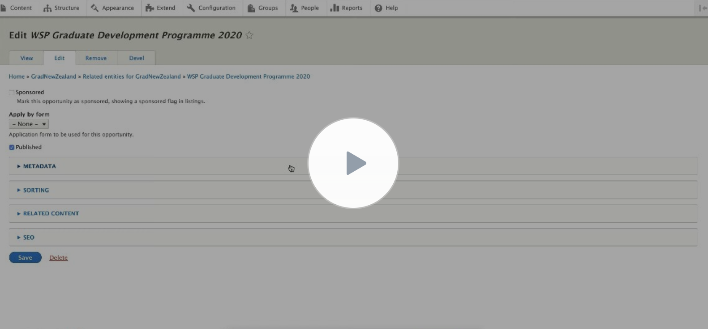
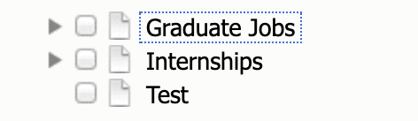

## Getting Started

This module is a zero configuration setup.

In order to get started using this module you need to install the Term Reference Fancytree module as you would any Drupal
module. No dependencies are required.

After the module is installed you can just go to any entity's form manage screen, and select "Term Reference Fancytree" as a widget.

## Video Tutorial

[](https://www.youtube.com/watch?v=IkSw3A65gFM)

## Dynamic Loading

The widget loads terms in the following fashion:

1) First, the top level nodes are loaded. These can be either top level terms in the taxonomy, or the vocabulary names in the case of a field using multiple vocabularies.
2) The widget will also load tree levels that contain selections.

This means that lazyloading is only applied to tree levels without selections.

## Active trail

An active trail class is added to all nodes that have selected children and a style is applied so that you can see, for example, if a non expanded, unselected term has selected children.



## Multiple Taxonomies

In case a field has been configured with multiple taxonomies, these will appear as unselectable "folders" in the tree.


**Note:** The module doesn't currently support non default selection handlers in the reference field settings (such as Views).

## Bulk selection

You can bulk select terms in the hierarchy by double clicking a parent.

If a parent is deselected and you double click, *all* child terms from all term and subterms will be selected.

If a parent is selected and you double click, *all* child terms from all term and subterms will be deselected.

**Note:** The selection will only apply to loaded levels. This means that if you double click a parent and one if it's children has child terms but hasn't been expanded (or its children dont' contain selections) those won't be affected by bulk selection.

## Extending via Fancytree API

The Term Reference Fancytree module is built on top of the Fancytree API. This means you can extend it in any way you want by just using JQuery and the API.

Example:

```javascript
$("#tree-id").fancytree("option", "aria", false);
```

For the complete API visit [the fancytree API page](https://wwwendt.de/tech/fancytree/doc/jsdoc/)
